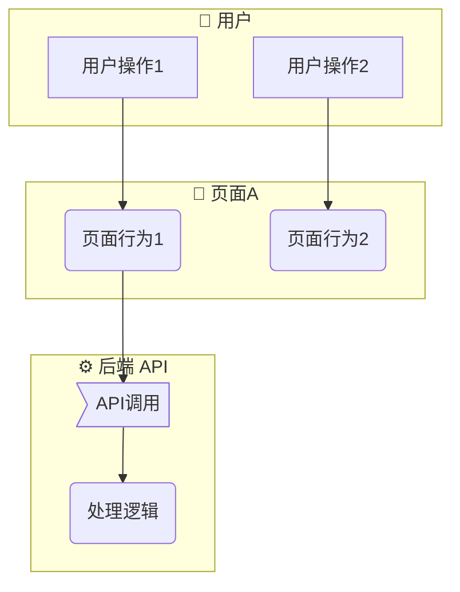
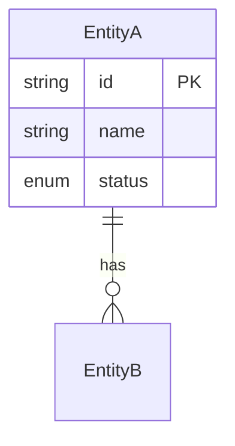
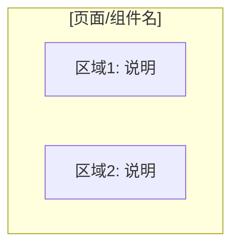
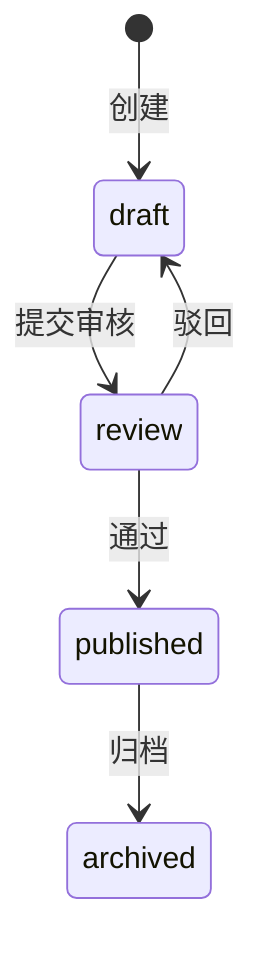

# PRD 编写模板

> 本文件是 `write-prd` Skill 的完整模板参考。编写 PRD 时，每个章节按此格式填充。
> 模板来源：`00-参考产物/prd-convention.md`

---

## §1 概述

```markdown
# [模块名] 产品需求规格书（PRD）

> **模块**：[模块标识，如 M1-项目管理]
> **状态**：draft | review | approved
> **版本**：v1.0
> **日期**：YYYY-MM-DD
> **作者**：[PM/AI]
> **关联文档**：
>   - 领域模型 → `docs/02-domain-model/domain-model.md#章节`
>   - 技术方案 → `docs/04-tech-design/phase1-design-tech.md#章节`
>   - 数据库 Schema → `docs/05-data-design/phase1-database-schema.md#表名`

---

## 1. 概述

### 1.1 定位与目标

[一段话描述本模块在系统中的位置、解决什么问题、核心价值]

### 1.2 用户角色

| 角色 | 描述 | 本模块权限 |
|------|------|:---------:|
| [角色名] | [描述] | 读/写/无 |

### 1.3 前置依赖

| 依赖项 | 状态 | 说明 |
|--------|:----:|------|
| [依赖] | ✅/⏳/❌ | [说明是否阻塞] |
```

---

## §2 业务流程

业务流程是 PRD 的骨架。必须先完成本章再进入 §4。

### 2.1 主业务流程（Happy Path）— 必填

```markdown
## 2. 业务流程

### 2.1 模块级主业务流程（Happy Path）

> 本流程描述用户在本模块中完成核心目标的典型路径（不含异常分支）。


```

**Mermaid 节点形状约定**：

| 含义 | 语法 | 示例 |
|------|------|------|
| 用户操作 | `[文本]` | `[点击新建按钮]` |
| 系统/页面行为 | `([文本])` | `(显示创建表单)` |
| 判断/条件 | `{文本}` | `{校验通过？}` |
| 数据/状态 | `[[文本]]` | `[[status=draft]]` |
| API 调用 | `>文本]` | `>POST /api/projects]` |
| 开始/结束 | `([*])` | — |

**泳道约定**：
- 泳道代表活动执行者（用户/页面/API/数据库）
- 格式：`Emoji + 执行者名称`
- 常用前缀：`👤 用户` / `📄 [页面名]` / `⚙️ 后端 API` / `🗄️ 数据库`

### 2.2 完整流程（含异常分支）— 按需

当功能点有复杂分支（>3 步判断路径）时，在此绘制完整流程。简单功能点可在 §4.X.3 的操作流程表中覆盖。

```markdown
### 2.2 完整流程（含异常分支）

#### 2.2.X [功能点名] 完整流程


```

### 2.3 页面交互流程 — 按需

仅当单页面交互超过 5 个步骤时才需要单独绘制。

---

## §3 功能范围总览

```markdown
## 3. 功能范围总览

### 3.1 功能清单

| # | 功能点 | 优先级 | 描述 | 对应章节 |
|---|--------|:------:|------|:--------:|
| F-Mx-NN | [功能名] | P0/P1/P2 | [一句话] | §4.X |

**编号规则**：`F-[模块标识]-[序号]`，如 `F-M1-01`、`F-M2-03`。全局唯一，从 01 开始递增。

**优先级**：P0=MVP 必须有 | P1=首批迭代 | P2=后续优化

### 3.2 Out of Scope（不在本模块范围内）

| 功能 | 原因 | 归属 |
|------|------|------|
| [功能] | [为什么不做] | [哪个 Phase/模块] |

### 3.3 术语表（按需）

> 仅当模块有领域特有术语时才写。

| 术语 | 定义 |
|------|------|
| [术语] | [定义] |
```

---

## §4 功能点详细设计（核心章节）

这是 PRD 的主体。**每个功能点是自包含的编码单元**，固定 6 个子节结构——但每节内容"有无"由实际需求决定。

```markdown
## 4. 功能点详细设计

### 4.X [功能点名]

> **编号**：F-Mx-NN
> **优先级**：P0/P1/P2
> **前置功能**：（无 / F-Mx-MM）

#### 4.X.1 涉及的领域模型

| 实体 | 用途 | 关键字段 | 引用 |
|------|------|---------|------|
| [Entity] | [在本功能中的角色] | [本功能用到的字段列表] | `domain-model.md#§X.X` |

**实体关系图（涉及多实体时必须提供）**：



#### 4.X.2 页面设计

**布局结构**：



**元素清单**：

| 区域 | 元素 | 类型 | 必填 | 说明 |
|------|------|------|:----:|------|
| [区域名] | [元素名] | Input/Button/Table/Select/Modal/Toast/... | ✅/- | [说明] |

**可用元素类型**：

| 类型 | 适用场景 |
|------|---------|
| Input | 单行文本输入 |
| Textarea | 多行文本输入 |
| Select | 下拉选择（单选/多选） |
| Radio | 单选组 |
| Checkbox | 复选框/开关 |
| Datepicker | 日期选择 |
| Table | 数据表格（排序/筛选/分页） |
| Button | 操作按钮（主要/次要/危险/幽灵） |
| Modal | 弹窗（确认/表单/详情） |
| Toast | 轻量提示（成功/错误/警告/信息） |
| Tag/Badge | 状态标签 |
| Tabs | 选项卡切换 |
| Form | 表单容器 |
| Card | 卡片容器 |
| Sidebar/Panel | 侧边栏/抽屉面板 |
| Pagination | 分页器 |
| Search | 搜索框 |
| Filter | 筛选器 |
| Empty | 空状态占位 |

#### 4.X.3 交互行为

**主操作流程**：

| 步骤 | 用户操作 | 系统响应 | 前置条件 | 异常处理 |
|------|---------|---------|---------|---------|
| 1 | [用户做了什么] | [界面变化/API调用] | [条件] | [异常→提示] |
| 2 | ... | ... | ... | ... |

**状态机（有状态流转时必须提供）**：

> **⚠️ 一致性校验（必须执行）**：
> 状态机中的状态清单必须与 domain-model 中对应实体的 status/state 枚举值**完全一致**。
> - 多出 → 检查是否遗漏枚举值定义
> - 缺少 → 检查是否遗漏转换路径
> - 命名不一致 → 以 domain-model 为准



**状态枚举对照表**：

| 状态机状态 | domain-model 枚举值 | 一致？ |
|:----------:|:------------------:|:------:|
| draft | draft | ✅ |
| ... | ... | ✅/❌ |

**快捷操作 / 批量操作**（如有）：

| 操作 | 触发方式 | 行为 | 确认机制 |
|------|---------|------|:--------:|
| [操作名] | [如何触发] | [做什么] | 弹窗/直接/无 |

#### 4.X.4 业务规则

**校验规则**：

| 字段 | 规则 | 错误提示 |
|------|------|---------|
| [字段] | [约束条件] | [提示文案] |

**业务约束**：

| # | 规则 | 说明 |
|---|------|------|
| B-Mx-[序号] | [规则描述] | [影响范围] |

**异常场景**：

| 场景 | 触发条件 | 系统行为 |
|------|---------|---------|
| [异常名] | [条件] | [怎么处理] |

#### 4.X.5 数据规格

**输入数据**：

| 字段 | 类型 | 必填 | 默认值 | 校验规则 | 说明 |
|------|------|:----:|:------:|---------|------|
| [field] | string/int/enum/date/boolean/json/... | ✅/- | [值] | [规则] | [说明] |

**输出数据 / 响应格式**：

| 字段 | 类型 | 来源 | 说明 |
|------|------|------|------|
| [field] | type | DB字段/计算 | [说明] |

**枚举值定义**（如有枚举字段）：

```typescript
type [EnumName] = 'value1' | 'value2' | 'value3';
// value1: [中文含义]
// value2: [中文含义]
// value3: [中文含义]
```

#### 4.X.6 AI 编码提示

> 仅记录「AI 实现此功能时容易出错或需要注意的点」，不重复技术方案已覆盖的内容。

- **[注意点1]**：[具体说明 + 原因]
- **[注意点2]**：[具体说明 + 原因]
```

---

## §5 跨功能规则

```markdown
## 5. 跨功能规则

> 本节记录影响**多个功能点**的全局规则，避免在每个功能点中重复定义。
> 如果某个规则只影响一个功能点，应写在 §4.X.4 中。

### 5.1 全局状态流转约束

（当多个功能点共享同一实体的状态机时，在此汇总完整状态机，各功能点的状态机子节引用此处）

### 5.2 全局校验规则

| # | 规则 | 影响范围 | 说明 |
|---|------|---------|------|
| G-Mx-[序号] | [规则描述] | 涉及的功能点列表 | [说明] |

### 5.3 全局交互约定

| 约定项 | 规则 | 示例 |
|--------|------|------|
| 删除操作 | 必须二次确认弹窗 | "确定删除「XXX」？删除后不可恢复" |
| 列表分页 | 默认 pageSize=20，可选 10/50/100 | — |
| 表单保存 | 成功后 toast + 自动跳转/刷新 | "创建成功" → 跳转详情 |
| 空状态 | 无数据时显示空状态占位 + 引导操作 | "暂无数据，点击新建" |
| 加载状态 | 异步操作期间显示 loading | Skeleton / Spinner |
| 错误反馈 | 接口错误显示具体错误信息 | Error Boundary + Toast |

### 5.4 权限与访问控制

（无认证时写"本阶段无权限控制，所有功能对当前用户完全开放"，后续 Phase 补充）
```

---

## §6 验收标准

```markdown
## 6. 验收标准

> 每条标准对应一个**可测试的验收条件**，用于测试用例设计和实现后验证。

### 6.1 功能验收（按功能点）

| # | 验收项 | 对应功能点 | 验证方式 | 通过标准 |
|---|--------|:---------:|---------|---------|
| AC-Mx-[NN] | [可测试的描述] | F-Mx-NN | 手动 / 自动化 | [什么算通过] |

### 6.2 边界 & 异常场景验收

| # | 验收项 | 对应功能点 | 验证方式 | 通过标准 |
|---|--------|:---------:|---------|---------|
| AC-Mx-[NN] | [异常场景描述] | F-Mx-NN | 手动 / 自动化 | [预期行为] |

### 6.3 UI/UX 验收

| # | 验收项 | 验证方式 | 通过标准 |
|---|--------|---------|---------|
| AC-Mx-[NN] | [UI/UX 可测试条件] | 目视检查 / 截图对比 | [标准] |
```

**验收标准编写要求**：
- 每条必须是**可执行的测试步骤**
- 给定相同输入，任何执行者应得到相同的通过/不通过结论
- 禁止模糊表述："功能正常"、"正确显示"、"可用"
