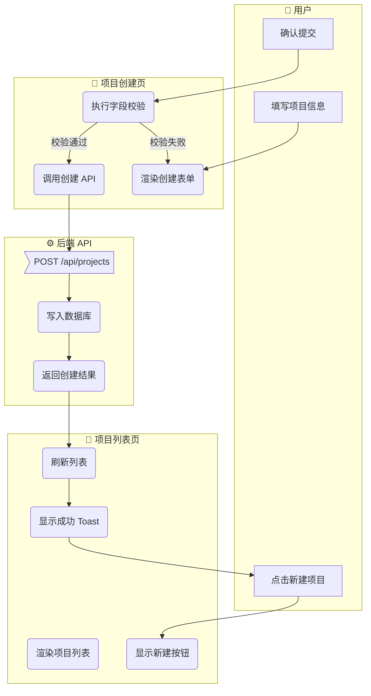
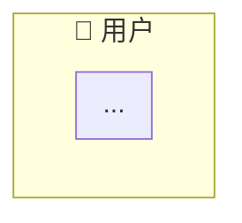
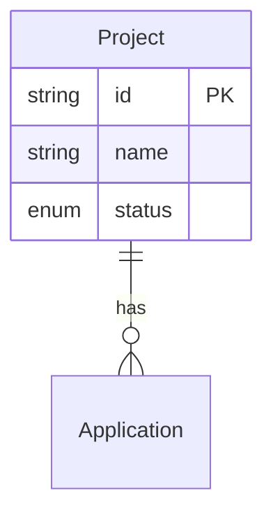
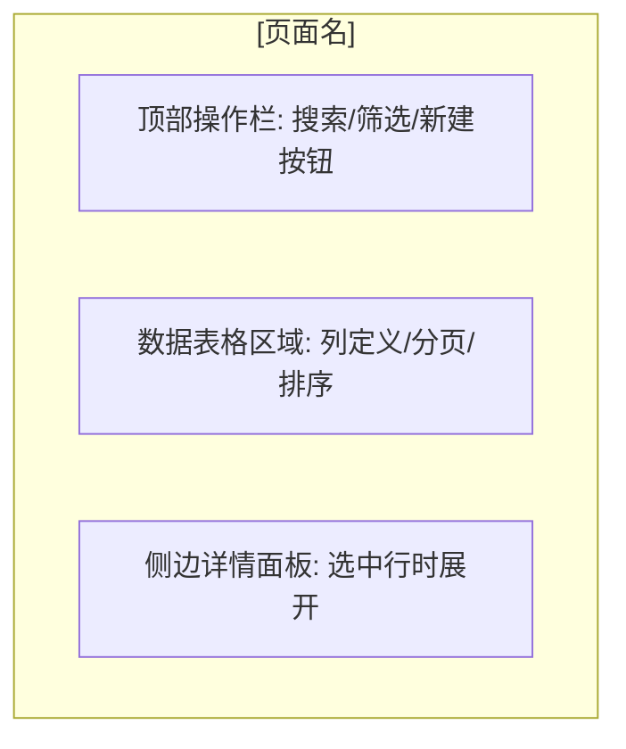
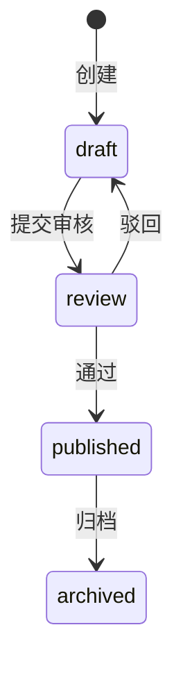

# PRD 编写规范

> **文档编号**：docs/03-prd/prd-convention.md
> **状态**：v1.0 approved
> **日期**：2026-05-01
> **定位**：本项目中所有模块 PRD 的编写模板与格式规范
> **适用范围**：Step 2（产品 PRD 设计）的产出物，存放于 `docs/03-prd/` 目录

---

## 0. 核心原则

1. **双目标**：PRD 既要是人可读的产品文档，也要是 AI 可消费的结构化规格
2. **产品层为主**：定义「做什么」，不涉及「怎么做」（技术方案归 Step 3）
3. **实现级粒度**：每个按钮的点击行为、每个字段的校验规则、每种异常场景的处理——AI 可直接依据此 PRD 写出完整代码
4. **AI 编码提示为辅**：仅记录实现陷阱，不重复技术方案已覆盖的内容
5. **以功能点为原子单元**：每个功能点自包含所有维度（领域模型→页面→交互→规则→数据→AI 提示）

---

## 1. 文档结构总览

```
# [模块名] 产品需求规格书（PRD）
> 元信息头

## 1. 概述
│  1.1 定位与目标
│  1.2 用户角色
│  1.3 前置依赖
│
## 2. 业务流程 ★ 骨架
│  2.1 模块级主业务流程（Happy Path）
│  2.2 完整流程（含异常分支）
│  2.3 页面交互流程
│
## 3. 功能范围总览
│  3.1 功能清单
│  3.2 Out of Scope
│  3.3 术语表（按需）
│
## 4. 功能点详细设计 ★ 血肉（核心）
│  4.X [功能点名]
│  │  4.X.1 涉及的领域模型
│  │  4.X.2 页面设计
│  │  4.X.3 交互行为
│  │  4.X.4 业务规则
│  │  4.X.5 数据规格
│  │  4.X.6 AI 编码提示
│
## 5. 跨功能规则
│  5.1 全局状态流转约束
│  5.2 全局校验规则
│  5.3 全局交互约定
│  5.4 权限与访问控制
│
## 6. 验收标准
   6.1 功能验收
   6.2 边界 & 异常场景验收
   6.3 UI/UX 验收
```

**共 6 章**。§2 业务流程为骨架（定义用户完成目标的路径），§4 功能点设计为血肉（每个功能的完整规格）。

---

## 2. 各章节详细规范

### 2.1 §1 概述

```markdown
# [模块名] 产品需求规格书（PRD）

> **模块**：[模块标识，如 M1-项目管理]
> **状态**：draft | review | approved
> **版本**：v1.0
> **日期**：YYYY-MM-DD
> **作者**：[PM/AI]
> **关联文档**：
>   - 领域模型 → `docs/02-domain-model/domain-model.md#章节`
>   - 技术方案 → `docs/04-tech-design/phase1-design-tech.md#章节`
>   - 数据库 Schema → `docs/05-data-design/phase1-database-schema.md#表名`

---

## 1. 概述

### 1.1 定位与目标

[一段话描述本模块在系统中的位置、解决什么问题、核心价值]

### 1.2 用户角色

| 角色 | 描述 | 本模块权限 |
|------|------|:---------:|
| [角色名] | [描述] | 读/写/无 |

### 1.3 前置依赖

| 依赖项 | 状态 | 说明 |
|--------|:----:|------|
| [依赖] | ✅/⏳/❌ | [说明是否阻塞] |
```

---

### 2.2 §2 业务流程

业务流程是 PRD 的骨架，定义用户在系统中完成目标的完整路径。

#### 2.2.1 流程图格式规范

**统一使用 Mermaid `flowchart TD`**，通过不同节点形状区分操作类型，通过 `subgraph` 实现泳道。

**节点形状约定**：

| 含义 | Mermaid 语法 | 示例 |
|------|-------------|------|
| **用户操作** | `[文本]` （矩形） | `[点击新建按钮]` |
| **系统/页面行为** | `([文本])` （圆角矩形） | `(显示创建表单)` |
| **判断/条件** | `{文本}` （菱形） | `{表单校验通过？}` |
| **数据/状态** | `[[文本]]` （类 Stadium 形） | `[[项目 status=draft]]` |
| **API 调用** | `>文本]` （非对称形） | `>POST /api/projects]` |
| **开始/结束** | `([*])` | — |

**泳道约定**：

- 泳道代表**活动执行者**，可以是用户、页面、API、数据库等
- 使用 `subgraph` 定义泳道，命名格式：`Emoji + 执行者名称`
- 常用泳道前缀：
  - `👤 用户` — 用户操作
  - `📄 [页面名]` — 页面级行为
  - `⚙️ 后端 API` — API 调用和处理
  - `🗄️ 数据库` — 数据读写

**流程图示例**：



#### 2.2.2 三级流程的粒度与位置

| 流程类型 | 粒度 | 泳道示例 | 出现位置 | 必填 |
|---------|------|---------|---------|:----:|
| **主业务流程（Happy Path）** | 模块级 | 用户 / 页面A / 页面B / API | §2.1 | ✅ |
| **完整流程（含异常分支）** | 功能点级 | 用户 / 页面 / API / DB | §2.2 或 §4.X.3 引用 | ⚠️ 有复杂分支时 |
| **页面交互流程** | 单页面级 | 用户 / UI组件 / 状态管理 | §4.X.3 内嵌或 §2.3 | ⚠️ 交互复杂时 |

#### 2.2.3 §2 章节模板

```markdown
## 2. 业务流程

### 2.1 模块级主业务流程（Happy Path）

> 本流程描述用户在本模块中完成核心目标的典型路径（不含异常分支）。



### 2.2 完整流程（含异常分支）

> 按功能点展开，包含判断分支、异常处理、回退路径。
> 若某功能点的完整流程较简单（≤3 步），可在 §4.X.3 交互行为的操作流程表中覆盖，无需在此重复绘制。

#### 2.2.X [功能点名] 完整流程


### 2.3 页面交互流程

> 单页面内的交互细节，作为 §4.X.2 页面设计和 §4.X.3 交互行为的图形化补充。
> 仅当页面交互超过 5 个步骤时才需要单独绘制。

#### 2.3.X [页面名] 交互流程


```

---

### 2.3 §3 功能范围总览

```markdown
## 3. 功能范围总览

### 3.1 功能清单

| # | 功能点 | 优先级 | 描述 | 对应章节 |
|---|--------|:------:|------|:--------:|
| F-Mx-NN | [功能名] | P0/P1/P2 | [一句话] | §4.X |

**功能点编号规则**：
- 格式：`F-[模块标识]-[序号]`，如 `F-M1-01`、`F-M2-03`
- 全局唯一，方便跨文档引用
- 序号从 01 开始递增

**优先级定义**：
- **P0**：MVP 必须有，阻塞发布
- **P1**：首批迭代，发布后尽快补齐
- **P2**：后续优化，有时间再做

### 3.2 Out of Scope（不在本模块范围内）

| 功能 | 原因 | 归属 |
|------|------|------|
| [功能] | [为什么不做] | [哪个 Phase/模块] |

### 3.3 术语表

> 仅当模块有领域特有术语时才写。通用术语不重复定义。

| 术语 | 定义 |
|------|------|
| [术语] | [定义] |
```

---

### 2.4 §4 功能点详细设计（核心）

这是 PRD 的主体，每个功能点是一个**自包含的编码单元**。6 个子节为固定结构，但每节内容"有无"由实际需求决定——没有状态流转就不写状态机，没有枚举就不写枚举定义。

```markdown
## 4. 功能点详细设计

### 4.X [功能点名]

> **编号**：F-Mx-NN
> **优先级**：P0/P1/P2
> **前置功能**：（无 / F-Mx-MM）

#### 4.X.1 涉及的领域模型

| 实体 | 用途 | 关键字段 | 引用 |
|------|------|---------|------|
| [Entity] | [在本功能中的角色] | [本功能用到的字段列表] | `domain-model.md#§X.X` |

**实体关系图（涉及多实体时必须提供）**：



#### 4.X.2 页面设计

**布局结构**：



**元素清单**：

| 区域 | 元素 | 类型 | 必填 | 说明 |
|------|------|------|:----:|------|
| [区域名] | [元素名] | Input/Button/Table/Select/Modal/Toast/... | ✅/- | [说明] |

**元素类型清单**：

| 类型 | 适用场景 |
|------|---------|
| Input | 单行文本输入 |
| Textarea | 多行文本输入 |
| Select | 下拉选择（单选/多选） |
| Radio | 单选组 |
| Checkbox | 复选框/开关 |
| Datepicker | 日期选择 |
| Table | 数据表格（支持排序/筛选/分页） |
| Button | 操作按钮（主要/次要/危险/幽灵） |
| Modal | 弹窗（确认/表单/详情） |
| Toast | 轻量提示（成功/错误/警告/信息） |
| Tag/Badge | 状态标签 |
| Tabs | 选项卡切换 |
| Form | 表单容器 |
| Card | 卡片容器 |
| Sidebar/Panel | 侧边栏/抽屉面板 |
| Breadcrumb | 面包屑导航 |
| Pagination | 分页器 |
| Search | 搜索框 |
| Filter | 筛选器 |
| Empty | 空状态占位 |
| ErrorBoundary | 错误边界 |

#### 4.X.3 交互行为

**主操作流程**：

| 步骤 | 用户操作 | 系统响应 | 前置条件 | 异常处理 |
|------|---------|---------|---------|---------|
| 1 | [用户做了什么] | [界面变化/API调用] | [条件] | [异常→提示] |
| 2 | ... | ... | ... | ... |

**状态机（有状态流转时必须提供）**：

> **⚠️ 一致性校验（必须执行）**：
> 状态机中的状态清单必须与 `docs/02-domain-model/domain-model.md` 中对应实体的 status/state 枚举值**完全一致**。
> - 状态机多出状态 → 检查是否遗漏了枚举值定义
> - 状态机缺少状态 → 检查是否遗漏了状态转换路径
> - 命名不一致 → 以 domain-model 为准，统一修正



**状态枚举对照表**：

| 状态机状态 | domain-model 枚举值 | 一致？ |
|:----------:|:------------------:|:------:|
| draft | draft | ✅ |
| review | review | ✅ |
| ... | ... | ✅/❌ |

**快捷操作 / 批量操作**（如有）：

| 操作 | 触发方式 | 行为 | 确认机制 |
|------|---------|------|:--------:|
| [操作名] | [如何触发] | [做什么] | 弹窗/直接/无 |

#### 4.X.4 业务规则

**校验规则**：

| 字段 | 规则 | 错误提示 |
|------|------|---------|
| [字段] | [约束条件] | [提示文案] |

**业务约束**：

| # | 规则 | 说明 |
|---|------|------|
| B-Mx-[序号] | [规则描述] | [影响范围] |

**异常场景**：

| 场景 | 触发条件 | 系统行为 |
|------|---------|---------|
| [异常名] | [条件] | [怎么处理] |

#### 4.X.5 数据规格

**输入数据**：

| 字段 | 类型 | 必填 | 默认值 | 校验规则 | 说明 |
|------|------|:----:|:------:|---------|------|
| [field] | string/int/enum/date/boolean/json/... | ✅/- | [值] | [规则] | [说明] |

**输出数据 / 响应格式**：

| 字段 | 类型 | 来源 | 说明 |
|------|------|------|------|
| [field] | type | DB字段/计算 | [说明] |

**枚举值定义**（如有枚举字段）：

```typescript
type [EnumName] = 'value1' | 'value2' | 'value3';
// value1: [中文含义]
// value2: [中文含义]
// value3: [中文含义]
```

#### 4.X.6 AI 编码提示

> 本节仅记录「AI 实现此功能时容易出错或需要注意的点」，不重复技术方案已覆盖的内容。

- **[注意点1]**：[具体说明 + 原因]
- **[注意点2]**：[具体说明 + 原因]
```

---

### 2.5 §5 跨功能规则

```markdown
## 5. 跨功能规则

> 本节记录影响**多个功能点**的全局规则，避免在每个功能点中重复定义。
> 如果某个规则只影响一个功能点，应写在 §4.X.4 中。

### 5.1 全局状态流转约束

（当多个功能点共享同一实体的状态机时，在此汇总完整状态机，各功能点的状态机子节引用此处）

### 5.2 全局校验规则

| # | 规则 | 影响范围 | 说明 |
|---|------|---------|------|
| G-Mx-[序号] | [规则描述] | 涉及的功能点列表 | [说明] |

### 5.3 全局交互约定

| 约定项 | 规则 | 示例 |
|--------|------|------|
| 删除操作 | 必须二次确认弹窗 | "确定删除「XXX」？删除后不可恢复" |
| 列表分页 | 默认 pageSize=20，可选 10/50/100 | — |
| 表单保存 | 成功后 toast 提示 + 自动跳转/刷新列表 | "创建成功" → 跳转详情 |
| 空状态 | 无数据时显示空状态占位 + 引导操作 | "暂无数据，点击新建" |
| 加载状态 | 异步操作期间显示 loading | Skeleton / Spinner |
| 错误反馈 | 接口错误显示具体错误信息 | Error Boundary + Toast |

### 5.4 权限与访问控制

（Phase 1 无认证时写"本阶段无权限控制，所有功能对当前用户完全开放"，后续 Phase 补充）
```

---

### 2.6 §6 验收标准

```markdown
## 6. 验收标准

> 每条标准对应一个**可测试的验收条件**，用于 Step 4 测试用例设计和 Step 5 代码实现后的验证。

### 6.1 功能验收（按功能点）

| # | 验收项 | 对应功能点 | 验证方式 | 通过标准 |
|---|--------|:---------:|---------|---------|
| AC-Mx-[NN] | [可测试的描述] | F-Mx-NN | 手动 / 自动化 | [什么算通过] |

### 6.2 边界 & 异常场景验收

| # | 验收项 | 对应功能点 | 验证方式 | 通过标准 |
|---|--------|:---------:|---------|---------|
| AC-Mx-[NN] | [异常场景描述] | F-Mx-NN | 手动 / 自动化 | [预期行为] |

### 6.3 UI/UX 验收

| # | 验收项 | 验证方式 | 通过标准 |
|---|--------|---------|---------|
| AC-Mx-[NN] | [UI/UX 可测试条件] | 目视检查 / 截图对比 | [标准] |

**验收标准编写要求**：
- 每条必须是**可执行的测试步骤**，禁止模糊表述如"功能正常"
- 给定相同输入，任何执行者应得到相同的通过/不通过结论
- 编号 `AC-`（Acceptance Criteria），与 `F-`（功能点）、`B-`（业务规则）、`G-`（全局规则）形成统一编号体系
```

---

## 3. 编号体系汇总

| 前缀 | 含义 | 格式 | 示例 |
|------|------|------|------|
| `F-` | 功能点 | `F-Mx-NN` | `F-M1-03` |
| `B-` | 业务规则（功能点内） | `B-Mx-NN` | `B-M1-05` |
| `G-` | 全局规则（跨功能点） | `G-Mx-NN` | `G-M1-02` |
| `AC-` | 验收标准 | `AC-Mx-NN` | `AC-M1-12` |

其中 `Mx` 为模块标识（M1/M2/...），`NN` 为两位序号（01/02/...）。

---

## 4. 编写检查清单

完成 PRD 后，逐项检查：

### 4.1 结构完整性

- [ ] §1 概述三小节齐全
- [ ] §2 业务流程至少包含主流程（Happy Path）
- [ ] §3 功能清单覆盖所有功能点，编号连续无跳跃
- [ ] §4 每个功能点至少包含 .1 领域模型 + .2 页面 + .3 交互 + .5 数据规格
- [ ] §5 全局规则无冗余（不与 §4 重复）
- [ ] §6 每个功能点至少有一条对应验收标准

### 4.2 一致性校验

- [ ] **状态机一致性**：每个状态机的状态集合 = domain-model 对应枚举值集合（§4.X.3 强制要求）
- [ ] **字段一致性**：§4.X.5 数据规格的字段 ⊆ §4.X.1 领域模型的字段
- [ ] **功能点完整性**：§3 功能清单中的每一项都在 §4 有对应的详细设计
- [ ] **验收覆盖率**：§6 验收标准覆盖 §3 所有 P0 功能点和关键 P1

### 4.3 质量门禁

- [ ] 无 TBD、TODO、待补充等占位符
- [ ] 无歧义表述（"适当"、"合理"、"可能"等词需替换为明确描述）
- [ ] Mermaid 图表语法正确（可在编辑器中预览渲染）
- [ ] 所有引用的关联文档路径和章节锚点有效
