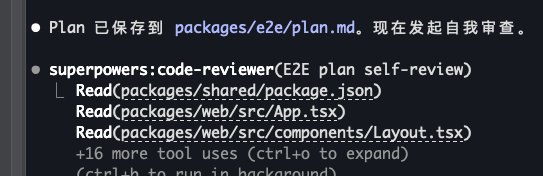

# 关于superpowers的问题和优化

- superpowers的brainstorm会要求AI写plan，但更好的实践应该是，让AI把plan内容文档话之后，再发起一次plan的自查，这样可以提前发现问题而不是等行动结束后再发现问题，下面是一个典型的plan：

``` 
E2E 测试框架搭建 Implementation Plan

 Context

 Phase 1 基础设施（INF-1~INF-6）已全部执行完毕，项目可运行（pnpm dev 启动前后端）。现在需要搭建 E2E
 测试框架，让 PM 能通过一条命令运行端到端测试，并把结果反馈给 AI 进行 bug 修复。

 设计文档：packages/e2e/README.md（已写好完整方案设计）
 当前状态：packages/e2e/ 目录只有 README.md，无 package.json、无 Playwright、无测试代码

 ---
 文件结构（最终产出）

 packages/e2e/
 ├── package.json                 # e2e 包配置 + 依赖
 ├── playwright.config.ts          # Playwright 配置（baseURL/浏览器/输出）
 ├── tests/
 │   └── smoke.spec.ts             # 冒烟测试（3 个 case）
 ├── helpers/
 │   └── api-client.ts            # API 调用封装
 └── test-results/                 # 自动生成报告（gitignore）

 ---
 Task 1: 初始化 e2e 包 + 安装 Playwright

 Step 1: 创建 packages/e2e/package.json

 {
   "name": "@apm/e2e",
   "version": "0.1.0",
   "private": true,
   "type": "module",
   "scripts": {
     "test": "playwright test",
     "test:headed": "playwright test --headed",
     "test:debug": "playwright test --debug",
     "report": "playwright show-report"
   },
   "devDependencies": {
     "@playwright/test": "^1.50.0"
   }
 }

 关键点：
 - 用 @playwright/test（不是 playwright），自带 test runner + 断言
 - test:headed 有头模式：调试时可以看到浏览器操作过程
 - test:debug 带 debugger 暂停：可以逐步执行
 - report 打开 HTML 报告

 Step 2: 创建 packages/e2e/playwright.config.ts

 import { defineConfig, devices } from '@playwright/test';

 export default defineConfig({
   testDir: './tests',
   fullyParallel: false,       // E2E 测试串行（避免 DB 并发冲突）
   forbidOnly: 'fixme',        // 只跑全部 case，不跳过
   retries: 0,                // 失败不重试（快速看到错误）

   use: {
     ...devices['Desktop Chrome'],
     viewport: { width: 1280, height: 720 },
   },

   webServer: {
     command: 'npx turbo run dev --port=5173',
     port: 5173,
     timeout: 120_000,         // 等待 dev server 启动
     reuseExistingServer: true,   // 如果已在运行则复用
   },

   outputDir: './test-results',
   screenshot: 'only-on-failure',  // 仅失败时截图
   trace: 'on-first-retry',        // 首次失败记录 trace

   reporter: [
     ['html', { open: 'never' }],  // 生成 HTML 报告但不自动打开
     ['json'],                     // 同时输出 JSON
   ],
 });

 关键设计决策：
 - baseURL 不硬编码 — 通过 webServer 启动 Vite dev server，Playwright 自动获得 baseURL
 - reuseExistingServer: true — 如果你已经跑了 pnpm dev，不会重复启动
 - fullyParallel: false — E2E 串行，避免 PG 并发写入冲突
 - screenshot: only-on-failure — pass 时不截图节省时间

 Step 3: 更新根 turbo.json，添加 test:e2e 任务

 在现有 turbo.json 的 tasks 中添加：

 "test:e2e": {
   "cache": false,
   "persistent": true
 }

 Step 4: 更新根 .gitignore，添加 e2e 产物忽略

 添加以下条目：
 test-results/
 playwright-report/

 Step 5: 运行 pnpm install 安装 Playwright + 浏览器

 Run: pnpm install
 Expected: @apm/e2e 下安装了 playwright + 浏览器二进制

 首次安装后需要初始化浏览器（Playwright 会提示）：
 Run: npx playwright install chromium （或按提示操作）

 ---
 Task 2: 编写 Smoke Test（冒烟测试）

 Step 1: 创建 packages/e2e/tests/smoke.spec.ts

 3 个 case，验证基础设施三层就绪：

 import { test, expect } from '@playwright/test';

 test.describe('基础设施冒烟', () => {
   test('前端能加载', async ({ page }) => {
     await page.goto('/');
     // Layout 渲染完成：APM 标题可见
     await expect(page.locator('text=APM')).toBeVisible();
     // 默认菜单「项目管理」可见
     await expect(page.locator('text=项目管理')).toBeVisible();
     // 重定向到 /projects 生效
     expect(page.url()).toContain('/projects');
   });

   test('后端 health check', async ({ request }) => {
     const resp = await request.get('/api/v1/health');
     expect(resp.ok()).toBeTruthy();
     const body = await resp.json();
     expect(body.data.status).toBe('ok');
   });

   test('数据库连通', async ({ request }) => {
     const resp = await request.get('/api/v1/health');
     const body = await resp.json();
     // 如果 DB 不可达，health 返回 degraded 且 db 字段存在
     if (body.data.db) {
       throw new Error(`DB 未连通: ${JSON.stringify(body.data)}`);
     }
     // 正常情况 db 字段不存在（只有 status=ok 时没有 db 字段）
   });
 });

 case 设计说明：
 - Case 1 验证 React → Router → Layout → Sidebar 全链路渲染
 - Case 2 验证 Fastify 响应 + JSON 格式正确
 - Case 3 验证 PostgreSQL 连通（通过 health check 间接检测）

 ---
 Task 3: 创建 API Client Helper

 Step 1: 创建 packages/e2e/helpers/api-client.ts

 封装 API 调用，供后续 M1~M6 spec 复用：

 /**
  * E2E 测试专用 API Client
  * 直接调用后端 REST API，绕过前端 UI
  * 用于数据准备、边界场景测试等
  */
 const API_BASE = '/api/v1';

 export interface ApiResponse<T> {
   data: T;
   meta?: { total: number; page: number; pageSize: number; totalPages: number };
 }

 export interface ApiError {
   error: { code: string; message: string; details?: unknown; requestId?: string };
 }

 class E2eApiClient {
   private baseUrl: string;

   constructor(baseUrl: string = API_BASE) {
     this.baseUrl = baseUrl;
   }

   private async request<T>(
     path: string,
     options?: RequestInit & { params?: Record<string, string> },
   ): Promise<ApiResponse<T>> {
     let url = `${this.baseUrl}${path}`;
     if (options?.params) {
       url += '?' + new URLSearchParams(options.params).toString();
       delete options.params;
     }

     const resp = await fetch(url, {
       headers: { 'Content-Type': 'application/json', ...options?.headers },
       ...options,
     } as Response);

     if (!resp.ok) {
       const error: ApiError = await resp.json().catch(() => ({
         error: { code: 'UNKNOWN_ERROR', message: `HTTP ${resp.status}` },
       }));
       throw new Error(`${error.error.code}: ${error.error.message}`);
     }

     return resp.json() as Promise<ApiResponse<T>>;
   }

   async get<T>(path: string, params?: Record<string, string>) {
     return this.request<T>(path, { method: 'GET', params });
   }

   async post<T>(path: string, body?: unknown) {
     return this.request<T>(path, {
       method: 'POST',
       body: body ? JSON.stringify(body) : undefined,
     });
   }

   async put<T>(path: string, body?: unknown) {
     return this.request<T>(path, {
       method: 'PUT',
       body: body ? JSON.stringify(body) : undefined,
     });
   }

   async delete<T>(path: string) {
     return this.request<T>(path, { method: 'DELETE' });
   }
 }

 /** 全局单例（在 spec 的 test.beforeAll 中创建） */
 export const api = new E2eApiClient();

 关键点：
 - baseURL 用 /api/v1 相对路径（Playwright 会自动解析到 dev server）
 - 错误时抛出清晰 Error，fail message 里直接显示 code:message
 - 后续 M1~M6 spec 可直接 api.get('/projects') 调用

 ---
 Task 4: 验证全流程

 Step 1: 确保 dev server 可用

 确认 Docker Compose PG 在运行（或至少 Fastify health check 不报 DB 错误）

 Step 2: 运行 smoke test

 # 方式 A：通过 turbo（推荐，自动管理 dev server）
 pnpm test:e2e -- tests/smoke.spec.ts

 # 方式 B：如果你已手动启动了 pnpm dev
 cd packages/e2e && npx playwright test tests/smoke.spec.ts

 # 方式 C：有头模式（调试时看浏览器操作）
 
 cd packages/e2e && npx playwright test --headed tests/smoke.spec.ts

 Expected: 3 个 case 全部 pass，终端输出绿色 ✅

 Step 3: 查看报告

 cd packages/e2e && npx playwright show-report

 浏览器打开 HTML 报告，确认报告结构正确（pass/fail 状态、截图位置等）

 Step 4: 验证 gitignore

 确认 test-results/ 未被 git 追踪

 ---
 执行顺序总结

 ┌──────┬─────────────────────────┬─────────────────────────────────────────────────────────────┐
 │ 步骤 │          任务           │                          产出文件                           │
 ├──────┼─────────────────────────┼─────────────────────────────────────────────────────────────┤
 │ 1    │ 初始化 e2e 包 +         │ package.json, playwright.config.ts, turbo.json 更新,        │
 │      │ Playwright              │ .gitignore 更新                                             │
 ├──────┼─────────────────────────┼─────────────────────────────────────────────────────────────┤
 │ 2    │ 安装依赖 + 浏览器       │ node_modules, chromium binary                               │
 ├──────┼─────────────────────────┼─────────────────────────────────────────────────────────────┤
 │ 3    │ 写 smoke test           │ tests/smoke.spec.ts                                         │
 ├──────┼─────────────────────────┼─────────────────────────────────────────────────────────────┤
 │ 4    │ 写 API helper           │ helpers/api-client.ts                                       │
 ├──────┼─────────────────────────┼─────────────────────────────────────────────────────────────┤
 │ 5    │ 运行验证                │ 终端 pass + 报告生成                                        │
 └──────┴─────────────────────────┴─────────────────────────────────────────────────────────────┘

 验证标准

 - pnpm install 无报错，@apm/e2e/node_modules/@playwright 存在
 - npx playwright install chromium 完成浏览器安装
 - pnpm test:e2e -- tests/smoke.spec.ts 输出 3/3 pass
 - test-results/index.html 可打开，含报告
 - git status 不应显示 test-results/ 或 playwright-report/ 为未跟踪

```

- superpowers的code-reviewer有时候会错误触发，比如要求它对plan做自我审查的时候：

