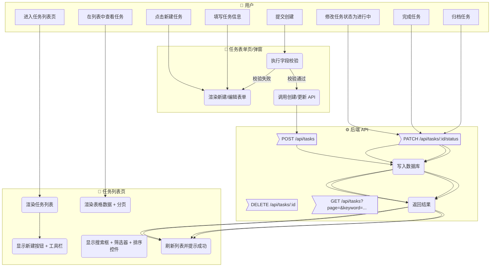
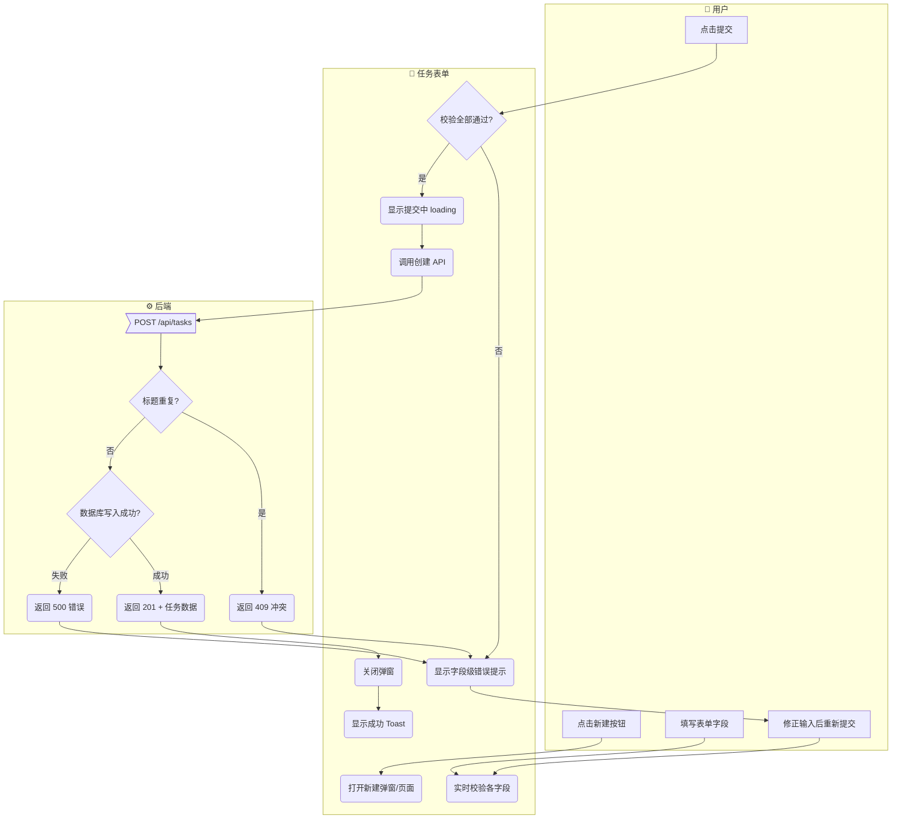
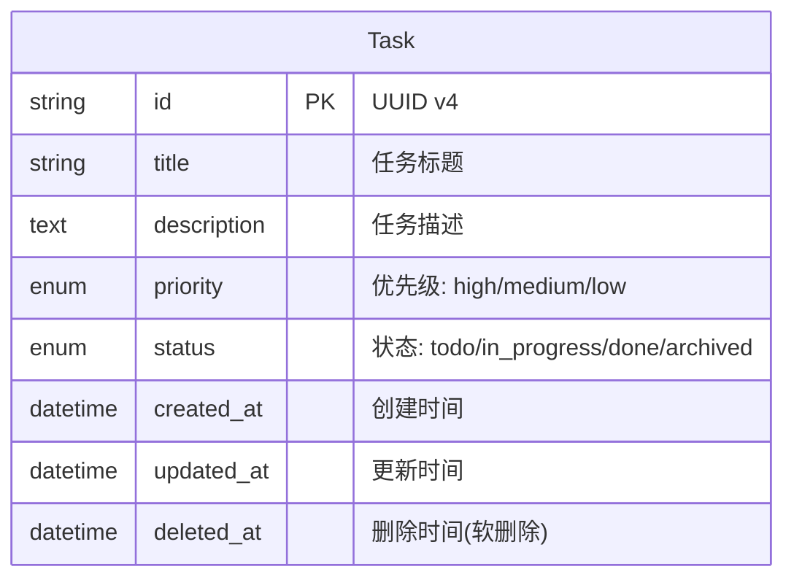
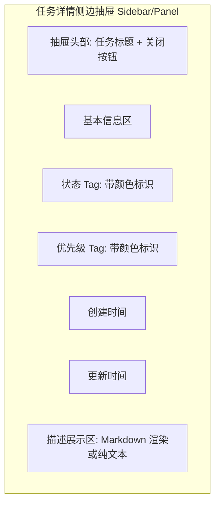
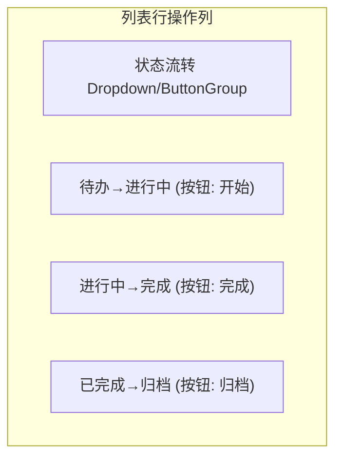
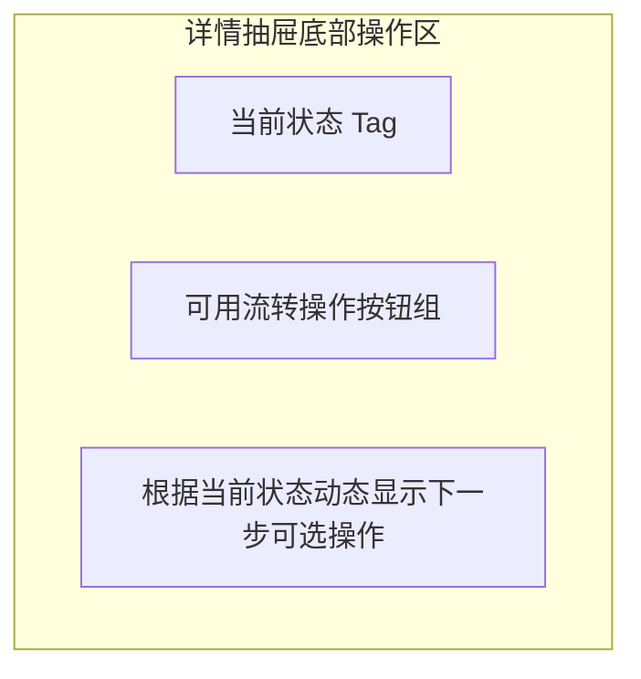
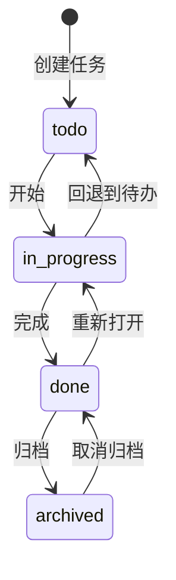
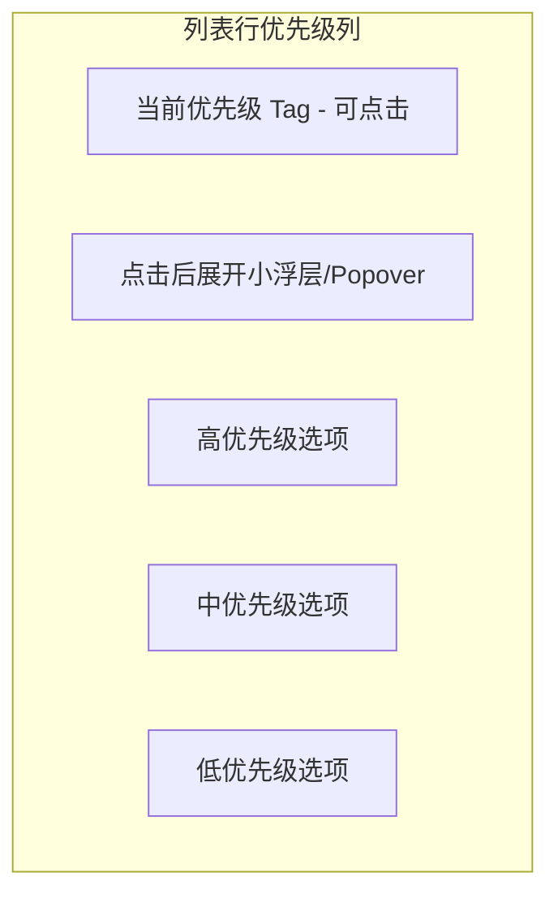
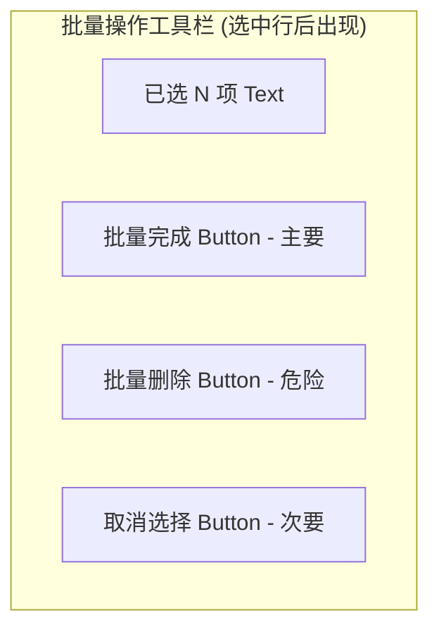
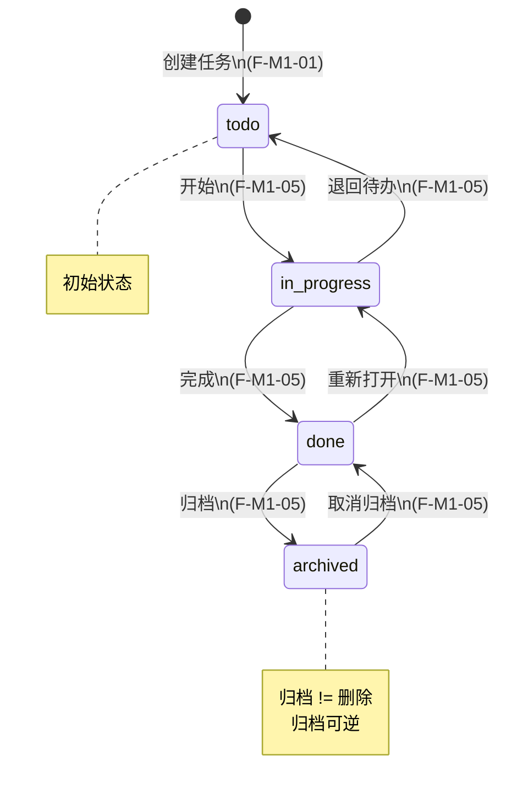

# 任务管理模块 产品需求规格书（PRD）

> **模块**：M1-任务管理
> **状态**：draft
> **版本**：v1.0
> **日期**：2026-05-01
> **作者**：AI PM 助手
> **关联文档**：
>   - 领域模型 → `docs/02-domain-model/domain-model.md#Task`（待创建）
>   - 技术方案 → `docs/04-tech-design/task-management-tech.md`（待创建）
>   - 数据库 Schema → `docs/05-data-design/task-management-schema.md`（待创建）

---

## 1. 概述

### 1.1 定位与目标

任务管理模块是 Harness Creator 平台的基础功能模块，为用户提供完整的任务生命周期管理能力。用户可以在此模块中创建、编辑、查看、删除任务，并通过状态流转机制跟踪任务的执行进度。该模块是后续项目管理和工作流编排的基础依赖，其核心价值在于提供一套标准化、可扩展的任务数据模型和操作接口，使 Agent 能够理解和管理工程过程中的各类任务项。

### 1.2 用户角色

| 角色 | 描述 | 本模块权限 |
|------|------|:---------:|
| 普通用户 | 使用平台进行日常任务管理的用户 | 读/写 |
| 管理员 | 具有系统管理权限的用户 | 读/写/批量操作 |

### 1.3 前置依赖

| 依赖项 | 状态 | 说明 |
|--------|:----:|------|
| 用户认证体系 | ⏳ | Phase 1 无认证，所有功能对当前用户完全开放 |
| 数据库基础设施 | ✅ | 需要关系型数据库支持 |
| 通用 UI 组件库 | ✅ | Table / Modal / Form / Toast / Pagination 等基础组件 |

---

## 2. 业务流程

### 2.1 模块级主业务流程（Happy Path）

> 本流程描述用户在本模块中完成核心目标的典型路径（不含异常分支）。



### 2.2 完整流程（含异常分支）

#### 2.2.1 创建任务 完整流程



---

## 3. 功能范围总览

### 3.1 功能清单

| # | 功能点 | 优先级 | 描述 | 对应章节 |
|---|--------|:------:|------|:--------:|
| F-M1-01 | 创建任务 | P0 | 新建一条任务记录，包含标题、描述、优先级等字段 | §4.1 |
| F-M1-02 | 查看任务详情 | P0 | 查看单个任务的完整信息 | §4.2 |
| F-M1-03 | 编辑任务 | P0 | 修改已有任务的信息 | §4.3 |
| F-M1-04 | 删除任务 | P0 | 删除单条任务（软删除） | §4.4 |
| F-M1-05 | 任务状态流转 | P0 | 驱动任务在 待办→进行中→已完成→归档 之间流转 | §4.5 |
| F-M1-06 | 设置任务优先级 | P0 | 为任务设置高/中/低优先级 | §4.6 |
| F-M1-07 | 任务列表查询 | P0 | 支持搜索、筛选、排序、分页的组合查询 | §4.7 |
| F-M1-08 | 批量完成 | P1 | 批量将多个任务标记为已完成 | §4.8 |
| F-M1-09 | 批量删除 | P1 | 批量删除多个任务 | §4.9 |

### 3.2 Out of Scope（不在本模块范围内）

| 功能 | 原因 | 归属 |
|------|------|------|
| 任务分配给指定用户 | Phase 1 无用户体系 | M2-团队协作 |
| 任务评论/讨论 | 非核心 MVP 范围 | M2-团队协作 |
| 任务截止日期提醒 | 需要定时任务基础设施 | M3-通知中心 |
| 任务标签/分类体系 | 可作为后续迭代增强 | M1-v1.1 |
| 子任务/任务依赖关系 | 复杂度高，非 MVP 必需 | M1-v1.2 |
| 任务导入/导出 | 非核心路径 | M1-v1.2 |
| 看板视图（Kanban） | 视图模式扩展 | M1-v1.1 |

### 3.3 术语表

| 术语 | 定义 |
|------|------|
| **任务（Task）** | 最小的工作单元，包含标题、描述、状态、优先级等属性 |
| **状态流转** | 任务从一个合法状态转换到另一个合法状态的过程 |
| **软删除** | 不物理删除数据记录，仅标记 `deleted_at` 字段，数据可恢复 |
| **批量操作** | 对多个选中的任务同时执行同一操作的交互模式 |

---

## 4. 功能点详细设计

### 4.1 创建任务

> **编号**：F-M1-01
> **优先级**：P0
> **前置功能**：无

#### 4.1.1 涉及的领域模型

| 实体 | 用途 | 关键字段 | 引用 |
|------|------|---------|------|
| Task | 本次操作的目标实体 | id, title, description, priority, status, created_at, updated_at | `domain-model.md#Task` |

**实体关系图**：



#### 4.1.2 页面设计

**布局结构**：

```mermaid
graph TD
    subgraph Modal["新建任务弹窗 Modal"]
        H1[弹窗标题: "新建任务"]
        F1[表单区域]
        F1A[标题 Input - 必填]
        F1B[描述 Textarea - 选填]
        F1C[优先级 Select - 默认"中"]
        FB[底部操作栏]
        FB1[取消 Button - 次要]
        FB2[确认创建 Button - 主要]
    end
```

**元素清单**：

| 区域 | 元素 | 类型 | 必填 | 说明 |
|------|------|------|:----:|------|
| 弹窗头部 | 标题文本 | Text | ✅ | 固定文案「新建任务」 |
| 表单区 | 标题输入框 | Input | ✅ | 单行文本，最大 100 字符，占位符「请输入任务标题」 |
| 表单区 | 描述输入框 | Textarea | - | 多行文本，最大 2000 字符，占位符「请输入任务描述（选填）」 |
| 表单区 | 优先级选择器 | Select | ✅ | 下拉选择，选项：高/中/低，默认值「中」 |
| 底部操作栏 | 取消按钮 | Button | ✅ | 次要样式，点击关闭弹窗不保存 |
| 底部操作栏 | 确认创建按钮 | Button | ✅ | 主要样式，点击后执行校验 → 提交 |

#### 4.1.3 交互行为

**主操作流程**：

| 步骤 | 用户操作 | 系统响应 | 前置条件 | 异常处理 |
|------|---------|---------|---------|---------|
| 1 | 点击「新建任务」按钮 | 打开新建任务弹窗，聚焦到标题输入框 | 位于任务列表页面 | — |
| 2 | 输入任务标题 | 实时显示字符计数（已输入/最大100），输入内容即时回显 | 弹窗已打开 | 输入超过 100 字符时阻止输入并提示「标题不能超过 100 个字符」 |
| 3 | 输入任务描述（可选） | 文本区域自适应高度，最大 6 行，超出出现滚动条 | — | 输入超过 2000 字符时阻止输入并提示「描述不能超过 2000 个字符」 |
| 4 | 选择优先级 | 下拉展开三个选项，选中后下拉收起并显示选中值 | — | — |
| 5 | 点击「确认创建」按钮 | 按钮进入 loading 状态（禁用重复点击），执行前端校验 | 所有必填字段已填写 | 校验失败时对应字段下方显示红色错误提示，按钮恢复可点击；API 失败时 Toast 显示错误信息 |
| 6 | 创建成功 | 弹窗关闭，列表自动刷新，顶部显示绿色 Toast「任务创建成功」，新任务出现在列表第一行 | API 返回 201 | — |
| 7 | 点击「取消」或弹窗外区域 | 弹窗关闭，不保存任何输入，列表不变 | 弹窗已打开 | 若有已输入内容，不做二次确认直接关闭 |

**快捷操作**：

| 操作 | 触发方式 | 行为 | 确认机制 |
|------|---------|------|:--------:|
| 快速创建 | 在标题输入框内按 Enter 键 | 相当于点击「确认创建」（前提是校验能通过） | 直接提交 |
| 取消创建 | 按 Esc 键 | 关闭弹窗 | 直接关闭 |

#### 4.1.4 业务规则

**校验规则**：

| 字段 | 规则 | 错误提示 |
|------|------|---------|
| title | 必填，不可为空字符串（纯空白也不允许） | 「请输入任务标题」 |
| title | 长度 1~100 个字符 | 「标题长度应在 1~100 个字符之间」 |
| title | 不可与现有未删除任务的标题完全重复（同一用户下） | 「已存在相同标题的任务，请修改」 |
| description | 选填，长度 0~2000 个字符 | 「描述不能超过 2000 个字符」 |
| priority | 必填，枚举值必须是 high / medium / low 之一 | 「请选择任务优先级」 |

**业务约束**：

| # | 规则 | 说明 |
|---|------|------|
| B-M1-01 | 新建任务初始状态固定为 `todo`（待办） | 用户无法在创建时手动指定状态 |
| B-M1-02 | 新建任务 `created_at` 和 `updated_at` 均取服务端当前时间 | 不使用客户端时间 |
| B-M1-03 | 同一用户下不允许存在两个标题完全相同的活跃（未删除）任务 | 去重校验在服务端执行 |
| B-M1-04 | 标题前后空白字符需自动 trim，trim 后再判断是否为空 | 前端 trim + 后端再次 trim 双保险 |

**异常场景**：

| 场景 | 触发条件 | 系统行为 |
|------|---------|---------|
| 网络中断 | 提交时网络不可达 | 显示 Toast「网络连接失败，请检查网络后重试」，按钮恢复可点击 |
| 服务端 500 | 内部服务器错误 | 显示 Toast「服务器内部错误，请稍后重试」，保留用户已输入的内容 |
| 服务端 409 | 标题冲突 | 标题输入框下方显示红色错误提示「已存在相同标题的任务，请修改」，光标聚焦到标题输入框 |
| 并发创建 | 两个请求几乎同时创建同标题任务 | 后端通过数据库唯一索引保证只有一个成功，另一个返回 409 |

#### 4.1.5 数据规格

**输入数据**：

| 字段 | 类型 | 必填 | 默认值 | 校验规则 | 说明 |
|------|------|:----:|:------:|---------|------|
| title | string | ✅ | — | 1~100 字符，非空，唯一 | 任务标题 |
| description | string | - | "" (空字符串) | 0~2000 字符 | 任务描述 |
| priority | enum | ✅ | "medium | 枚举值: high / medium / low | 任务优先级 |

**输出数据 / 响应格式**：

| 字段 | 类型 | 来源 | 说明 |
|------|------|------|------|
| id | string | DB 生成 (UUID v4) | 任务唯一标识 |
| title | string | 用户输入 | 任务标题 |
| description | string | 用户输入 | 任务描述 |
| priority | string | 用户输入 | 优先级枚举值 |
| status | string | 固定值 "todo" | 初始状态 |
| created_at | datetime ISO 8601 | 服务端生成 | 创建时间 |
| updated_at | datetime ISO 8601 | 服务端生成 | 更新时间（等于 created_at） |

**枚举值定义**：

```typescript
type TaskPriority = 'high' | 'medium' | 'low';
// high: 高优先级
// medium: 中优先级（默认）
// low: 低优先级

type TaskStatus = 'todo' | 'in_progress' | 'done' | 'archived';
// todo: 待办
// in_progress: 进行中
// done: 已完成
// archived: 已归档
```

#### 4.1.6 AI 编码提示

- **标题去重时机**：去重校验必须在服务端执行（防并发），前端可以做乐观校验提升体验但不能替代后端。前端可在 input blur 时调一个轻量接口预检标题是否重复。
- **弹窗关闭后的焦点管理**：弹窗关闭后应将焦点归还给触发打开弹窗的「新建任务」按钮，符合无障碍访问（a11y）最佳实践。
- **Textarea 自适应高度实现**：不要用固定高度加滚动条的方案，应用 JS 监听 input 事件动态调整 height（最小 2 行，最大 6 行），超出才出滚动条。

---

### 4.2 查看任务详情

> **编号**：F-M1-02
> **优先级**：P0
> **前置功能**：F-M1-01

#### 4.2.1 涉及的领域模型

| 实体 | 用途 | 关键字段 | 引用 |
|------|------|---------|------|
| Task | 展示目标 | 全部字段 | `domain-model.md#Task` |

#### 4.2.2 页面设计

**布局结构**：



**元素清单**：

| 区域 | 元素 | 类型 | 必填 | 说明 |
|------|------|------|:----:|------|
| 抽屉头部 | 任务标题 | Text | ✅ | 显示完整标题，超长截断加省略号（hover 出 tooltip） |
| 抽屉头部 | 关闭按钮 | Button | ✅ | 图标按钮（X），点击关闭抽屉 |
| 基本信息 | 状态标签 | Tag/Badge | ✅ | 根据 status 枚举值显示不同颜色：todo=灰色, in_progress=蓝色, done=绿色, archived=浅灰色 |
| 基本信息 | 优先级标签 | Tag/Badge | ✅ | 根据 priority 枚举值显示不同颜色：high=红色, medium=橙色, low=灰色 |
| 基本信息 | 创建时间 | Text | ✅ | 格式「YYYY-MM-DD HH:mm」 |
| 基本信息 | 更新时间 | Text | ✅ | 格式「YYYY-MM-DD HH:mm」 |
| 描述区 | 描述内容 | Text | - | 若 description 为空，显示占位文字「暂无描述」 |

#### 4.2.3 交互行为

**主操作流程**：

| 步骤 | 用户操作 | 系统响应 | 前置条件 | 异常处理 |
|------|---------|---------|---------|---------|
| 1 | 点击列表中某一行的任务 | 右侧滑出详情抽屉，高亮当前选中行 | 列表有数据 | — |
| 2 | 浏览任务详情信息 | 各字段按布局结构展示 | 抽屉已打开 | — |
| 3 | 点击关闭按钮或遮罩层 | 抽屉向右滑出关闭，取消列表行高亮 | 抽屉已打开 | — |
| 4 | 点击另一行的任务 | 抽屉内容切换为新任务数据，列表高亮行跟随切换 | 抽屉已打开 | — |

**快捷操作**：

| 操作 | 触发方式 | 行为 | 确认机制 |
|------|---------|------|:--------:|
| 关闭抽屉 | 按 Esc 键 | 关闭详情抽屉 | 直接关闭 |

#### 4.2.4 业务规则

**校验规则**：（本功能为只读展示，无用户输入校验）

**业务约束**：

| # | 规则 | 说明 |
|---|------|------|
| B-M1-05 | 详情数据以 API 返回为准，不从列表缓存读取 | 保证数据一致性 |
| B-M1-06 | 若任务已被删除（极端情况），抽屉显示「该任务不存在或已被删除」空状态 | 防止展示过期数据 |

**异常场景**：

| 场景 | 触发条件 | 系统行为 |
|------|---------|---------|
| 详情加载失败 | API 返回错误 | 抽屉内显示错误状态「加载失败，请重试」，提供重试按钮 |
| 任务已被删除 | 任务在查看期间被其他操作删除 | 显示空状态提示，关闭抽屉后列表自动刷新 |

#### 4.2.5 数据规格

**输入数据**：（无用户输入，由路由参数或点击事件传入 task_id）

**输出数据 / 响应格式**：

| 字段 | 类型 | 来源 | 说明 |
|------|------|------|------|
| id | string | DB | 任务 ID |
| title | string | DB | 任务标题 |
| description | string | DB | 任务描述 |
| priority | string | DB | 优先级 |
| status | string | DB | 当前状态 |
| created_at | datetime ISO 8601 | DB | 创建时间 |
| updated_at | datetime ISO 8601 | DB | 最后更新时间 |

#### 4.2.6 AI 编码提示

- **侧边抽屉宽度**：建议固定 480px 或屏幕宽度的 40%（取较小值），在小屏设备上可考虑全屏覆盖。
- **Tag 颜色映射**：优先级和状态的 Tag 颜色必须与列表页表格中的 Tag 颜色保持一致，建议抽取为共享常量/配置对象，避免硬编码散落在各处。

---

### 4.3 编辑任务

> **编号**：F-M1-03
> **优先级**：P0
> **前置功能**：F-M1-01, F-M1-02

#### 4.3.1 涉及的领域模型

| 实体 | 用途 | 关键字段 | 引用 |
|------|------|---------|------|
| Task | 编辑目标 | title, description, priority, updated_at | `domain-model.md#Task` |

#### 4.3.2 页面设计

**布局结构**：

```mermaid
graph TD
    subgraph Modal["编辑任务弹窗 Modal"]
        H1[弹窗标题: "编辑任务"]
        F1[表单区域 - 预填充当前值]
        F1A[标题 Input - 必填 - 预填充原标题]
        F1B[描述 Textarea - 选填 - 预填充原描述]
        F1C[优先级 Select - 预填充原优先级]
        FB[底部操作栏]
        FB1[取消 Button - 次要]
        FB2[保存修改 Button - 主要]
    end
```

**元素清单**：

| 区域 | 元素 | 类型 | 必填 | 说明 |
|------|------|------|:----:|------|
| 弹窗头部 | 标题文本 | Text | ✅ | 固定文案「编辑任务」 |
| 表单区 | 标题输入框 | Input | ✅ | 预填充当前任务标题，其余规则同创建 |
| 表单区 | 描述输入框 | Textarea | - | 预填充当前任务描述，其余规则同创建 |
| 表单区 | 优先级选择器 | Select | ✅ | 预填充当前优先级，其余规则同创建 |
| 底部操作栏 | 取消按钮 | Button | ✅ | 次要样式，关闭弹窗 |
| 底部操作栏 | 保存修改按钮 | Button | ✅ | 主要样式，执行校验 → PATCH 提交 |

#### 4.3.3 交互行为

**主操作流程**：

| 步骤 | 用户操作 | 系统响应 | 前置条件 | 异常处理 |
|------|---------|---------|---------|---------|
| 1 | 在详情抽屉中点击「编辑」按钮或在列表行操作列点击「编辑」图标 | 打开编辑弹窗，表单预填充当前任务数据 | 已选中一个任务 | — |
| 2 | 修改字段内容 | 实时校验，行为同创建表单 | 弹窗已打开 | 校验规则同创建 |
| 3 | 点击「保存修改」 | 按钮 loading，执行校验 → 调用更新 API | 有字段被修改 | 未做任何修改时按钮可置灰或提示「没有需要保存的更改」 |
| 4 | 保存成功 | 弹窗关闭，详情抽屉（若打开）刷新数据，列表刷新，Toast「任务更新成功」 | API 返回 200 | — |
| 5 | 点击「取消」 | 弹窗关闭，不做保存 | 弹窗已打开 | 若有修改内容，弹出确认对话框「确定放弃修改？」，确认后关闭 |

**快捷操作**：

| 操作 | 触发方式 | 行为 | 确认机制 |
|------|---------|------|:--------:|
| 保存修改 | Ctrl+Enter / Cmd+Enter | 相当于点击「保存修改」 | 直接提交（需校验通过） |

#### 4.3.4 业务规则

**校验规则**：

| 字段 | 规则 | 错误提示 |
|------|------|---------|
| title | 同创建任务校验规则 | 同创建 |
| description | 同创建任务校验规则 | 同创建 |
| priority | 同创建任务校验规则 | 同创建 |

**业务约束**：

| # | 规则 | 说明 |
|---|------|------|
| B-M1-07 | 标题唯一性校验排除自身 | 编辑时允许标题不变，仅与其他任务比较 |
| B-M1-08 | 仅当字段值确实发生变化时才发送 PATCH 请求 | 减少无效网络请求 |
| B-M1-09 | `updated_at` 在每次成功更新后刷新为服务端当前时间 | 用于排序和审计 |

**异常场景**：

| 场景 | 触发条件 | 系统行为 |
|------|---------|---------|
| 并发编辑冲突 | 两人同时编辑同一任务，后者提交时数据已被前者修改 | 采用「最后写入获胜」策略（Last Write Wins），后续可引入乐观锁优化 |
| 任务在编辑期间被删除 | 编辑提交时任务已被软删除 | 返回 404，Toast 显示「该任务已被删除」，关闭弹窗并刷新列表 |

#### 4.3.5 数据规格

**输入数据**：

| 字段 | 类型 | 必填 | 默认值 | 校验规则 | 说明 |
|------|------|:----:|:------:|---------|------|
| title | string | ✅ | 当前值 | 1~100 字符，非空，唯一（排除自身） | 任务标题 |
| description | string | - | 当前值 | 0~2000 字符 | 任务描述 |
| priority | enum | ✅ | 当前值 | high / medium / low | 任务优先级 |

**输出数据 / 响应格式**：同创建任务响应格式，额外包含 updated_at 的最新值。

#### 4.3.6 AI 编码提示

- **脏数据检测（Dirty Check）**：实现编辑功能时必须维护表单原始值的快照，与当前值做深比较来判断是否有变更。这决定了「取消」时是否需要确认弹窗，以及「保存」时是否发送请求。推荐使用表单库（如 React Hook Form / Ant Design Form）的 `dirty` 状态。
- **预填充时机的陷阱**：如果先打开弹窗再加载数据，会出现闪烁。正确做法是在弹窗打开前就拿到数据，打开时立即渲染。或者在弹窗打开动画期间异步加载并配合 Skeleton 占位。

---

### 4.4 删除任务

> **编号**：F-M1-04
> **优先级**：P0
> **前置功能**：F-M1-01

#### 4.4.1 涉及的领域模型

| 实体 | 用途 | 关键字段 | 引用 |
|------|------|---------|------|
| Task | 删除目标 | id, deleted_at | `domain-model.md#Task` |

#### 4.4.2 页面设计

**布局结构**：

```mermaid
graph TD
    subgraph ConfirmDialog["删除确认对话框 Modal"]
        D1[图标: 警告图标(红色)]
        D2[标题: "确认删除"]
        D3[内容: "确定删除任务「XXX」？删除后不可恢复。"]
        D4[底部操作栏]
        D4A[取消 Button - 次要]
        D4B[确认删除 Button - 危险样式]
    end
```

**元素清单**：

| 区域 | 元素 | 类型 | 必填 | 说明 |
|------|------|------|:----:|------|
| 对话框 | 警告图标 | Icon | ✅ | 红色警告三角图标 |
| 对话框 | 标题 | Text | ✅ | 固定文案「确认删除」 |
| 对话框 | 提示内容 | Text | ✅ | 动态拼接：「确定删除任务「{任务标题}」？删除后不可恢复。」标题超长时截断至 30 字符加省略号 |
| 底部 | 取消按钮 | Button | ✅ | 次要样式，关闭对话框 |
| 底部 | 确认删除按钮 | Button | ✅ | 危险样式（红色背景），点击后执行删除 |

触发入口：列表每行操作列中的「删除」图标按钮。

#### 4.4.3 交互行为

**主操作流程**：

| 步骤 | 用户操作 | 系统响应 | 前置条件 | 异常处理 |
|------|---------|---------|---------|---------|
| 1 | 点击列表某行的「删除」图标 | 弹出删除确认对话框 | 列表有数据且行未被禁用 | — |
| 2 | 确认对话框内容 | 显示任务标题，用户核对 | 对话框已弹出 | — |
| 3 | 点击「确认删除」 | 按钮 loading，调用 DELETE API | 对话框已弹出 | — |
| 4 | 删除成功 | 对话框关闭，列表移除该行（带淡出动画），Toast「任务已删除」，若详情抽屉打开着则同步关闭 | API 返回 200 | — |
| 5 | 点击「取消」 | 对话框关闭，不做任何操作 | 对话框已弹出 | — |

**快捷操作**：无。

#### 4.4.4 业务规则

**校验规则**：（本功能为确认型操作，无输入校验）

**业务约束**：

| # | 规则 | 说明 |
|---|------|------|
| B-M1-10 | 采用软删除策略，设置 `deleted_at` 为当前时间 | 数据不物理删除，可恢复（恢复功能不在本次范围） |
| B-M1-11 | 已归档的任务也可以被删除 | 归档不是终态，删除才是 |
| B-M1-12 | 删除操作幂等：对已删除的任务再次删除返回成功（no-op） | 防止重复删除报错 |

**异常场景**：

| 场景 | 触发条件 | 系统行为 |
|------|---------|---------|
| 删除 API 失败 | 网络错误或服务端 500 | 对话框显示内联错误提示「删除失败，请重试」，提供重试按钮 |
| 任务已被他人删除 | 并发场景下任务已不存在 | 视同成功处理，关闭对话框并刷新列表（因为最终状态一致：任务不可见） |

#### 4.4.5 数据规格

**输入数据**：(路径参数) task_id

**输出数据 / 响应格式**：

| 字段 | 类型 | 来源 | 说明 |
|------|------|------|------|
| success | boolean | 服务端 | 是否成功 |
| message | string | 服务端 | 结果消息 |

#### 4.4.6 AI 编码提示

- **列表删除动画**：删除成功后不要立即从 DOM 移除行元素，应添加 CSS 过渡类（如 fade-out 300ms），动画结束后再移除 DOM 节点。这样用户体验更流畅。
- **详情抽屉联动**：如果删除的是当前正在查看详情的任务，删除成功后必须同步关闭详情抽屉，否则会展示已删除的数据。建议在删除 API 成功回调中统一处理。

---

### 4.5 任务状态流转

> **编号**：F-M1-05
> **优先级**：P0
> **前置功能**：F-M1-01

#### 4.5.1 涉及的领域模型

| 实体 | 用途 | 关键字段 | 引用 |
|------|------|---------|------|
| Task | 状态流转目标 | id, status, updated_at | `domain-model.md#Task` |

#### 4.5.2 页面设计

**布局结构**：

状态流转操作分布在两个位置：

**位置一：列表行内操作**



**位置二：详情抽屉内**



**元素清单**：

| 区域 | 元素 | 类型 | 必填 | 说明 |
|------|------|------|:----:|------|
| 列表操作列 | 状态流转按钮 | Button | ✅ | 文案根据当前状态动态变化：待办显示「开始」，进行中显示「完成」，已完成显示「归档」 |
| 列表操作列 | 状态 Tag | Tag/Badge | ✅ | 显示当前状态，带颜色 |
| 详情抽屉底部 | 流转按钮组 | Button Group | ✅ | 显示所有合法的下一步操作按钮 |
| 详情抽屉底部 | 当前状态 | Tag/Badge | ✅ | 大尺寸展示当前状态 |

#### 4.5.3 交互行为

**主操作流程**：

| 步骤 | 用户操作 | 系统响应 | 前置条件 | 异常处理 |
|------|---------|---------|---------|---------|
| 1 | 点击状态流转按钮（如「开始」「完成」「归档」） | 按钮短暂 loading，调用状态变更 API | 任务处于可流转的源状态 | 若任务处于终态（archived），按钮隐藏或禁用 |
| 2 | 状态变更成功 | 该行状态 Tag 颜色和文案更新，流转按钮文案更新为下一步操作，列表排序可能变化（如果按状态排序），Toast「任务已标记为 {新状态}」 | API 返回 200 | — |
| 3 | 状态变更失败 | 按钮恢复原状，Toast 显示错误信息 | API 返回非 200 | — |

**状态机**：

> **一致性校验（必须执行）**：
> 状态机中的状态清单必须与 domain-model 中 Task 实体的 status 枚举值完全一致。



**状态枚举对照表**：

| 状态机状态 | domain-model 枚举值 | 一致？ |
|:----------:|:------------------:|:------:|
| todo | todo | ✅ |
| in_progress | in_progress | ✅ |
| done | done | ✅ |
| archived | archived | ✅ |

**每种状态下可用的操作映射**：

| 当前状态 | 可执行的操作 | 目标状态 | 按钮文案 |
|---------|------------|---------|---------|
| todo（待办） | 开始 | in_progress | 「开始」 |
| in_progress（进行中） | 完成任务 | done | 「完成」 |
| in_progress（进行中） | 回退待办 | todo | 「退回待办」 |
| done（已完成） | 归档 | archived | 「归档」 |
| done（已完成） | 重新打开 | in_progress | 「重新打开」 |
| archived（已归档） | 取消归档 | done | 「取消归档」 |

**快捷操作 / 批量操作**：

| 操作 | 触发方式 | 行为 | 确认机制 |
|------|---------|------|:--------:|
| 归档操作 | 点击「归档」按钮 | 将已完成任务转为归档态 | 直接执行（归档可逆，无需强确认） |

#### 4.5.4 业务规则

**校验规则**：（状态值由系统控制，非用户自由输入）

**业务约束**：

| # | 规则 | 说明 |
|---|------|------|
| B-M1-13 | 状态流转必须遵循状态机定义的合法路径 | 非法转换（如 todo→done 跳过 in_progress）服务端拒绝，返回 400 |
| B-M1-14 | 每次状态变更必须更新 `updated_at` 时间戳 | 用于排序和追踪 |
| B-M1-15 | 归档状态不是终态，允许「取消归档」回到已完成 | 归档≠删除，归档只是表示不再活跃关注 |
| B-M1-16 | 不允许从待办直接跳转到已完成或归档 | 必须经过进行中（除非后续产品需求调整） |
| B-M1-17 | 不允许从待办或进行中直接跳转到归档 | 只有已完成的任务才能归档 |

**异常场景**：

| 场景 | 触发条件 | 系统行为 |
|------|---------|---------|
| 非法状态转换 | 客户端构造非法 target_status | 服务端返回 400「非法的状态转换：{源状态} → {目标状态}」 |
| 并发状态变更 | 两人同时对同一任务操作状态流转 | Last Write Wins，后提交者覆盖前者 |
| 任务已被删除 | 对已删除任务操作状态流转 | 返回 404「任务不存在」 |

#### 4.5.5 数据规格

**输入数据**：

| 字段 | 类型 | 必填 | 默认值 | 校验规则 | 说明 |
|------|------|:----:|:------:|---------|------|
| target_status | enum | ✅ | — | 必须是状态机中从当前状态可达的合法目标状态 | 目标状态 |

**输出数据 / 响应格式**：

| 字段 | 类型 | 来源 | 说明 |
|------|------|------|------|
| id | string | DB | 任务 ID |
| status | string | DB | 更新后的状态 |
| updated_at | datetime ISO 8601 | DB | 状态变更时间 |

#### 4.5.6 AI 编码提示

- **按钮动态显隐逻辑**：列表中每行的状态流转按钮应根据当前状态动态决定显示哪些。建议用一个映射表（Map<status, Action[]>）集中管理，避免在每个 if/else 分支中硬编码。
- **乐观更新策略**：状态流转操作适合做乐观更新——点击按钮后立即更新本地 UI 状态，后台异步调 API。若 API 失败则回滚到原状态并 Toast 提示。这样用户感知不到延迟。
- **回退操作的确认**：「退回待办」和「重新打开」属于回退操作，建议增加一次轻量确认（Tooltip 提示或简短确认），防止误触。但不需要像删除那样重的确认弹窗。

---

### 4.6 设置任务优先级

> **编号**：F-M1-06
> **优先级**：P0
> **前置功能**：F-M1-01

#### 4.6.1 涉及的领域模型

| 实体 | 用途 | 关键字段 | 引用 |
|------|------|---------|------|
| Task | 优先级修改目标 | id, priority, updated_at | `domain-model.md#Task` |

#### 4.6.2 页面设计

**布局结构**：

优先级设置有两种交互路径：

**路径一：通过编辑任务（复用 F-M1-03）**
- 在编辑弹窗中修改优先级字段，保存后生效

**路径二：快速切换（行内操作）**



**元素清单**：

| 区域 | 元素 | 类型 | 必填 | 说明 |
|------|------|------|:----:|------|
| 列表优先级列 | 优先级 Tag | Tag/Badge | ✅ | 可点击，点击后展开 Popover 选择器 |
| Popover | 优先级选项组 | Radio Group / Select | ✅ | 三个选项：高(红)/中(橙)/低(灰)，当前值高亮或打勾 |

#### 4.6.3 交互行为

**主操作流程（快速切换路径）**：

| 步骤 | 用户操作 | 系统响应 | 前置条件 | 异常处理 |
|------|---------|---------|---------|---------|
| 1 | 点击列表中某行的优先级 Tag | 在 Tag 旁边/下方展开 Popover 选择器 | 列表有数据 | — |
| 2 | 选择新的优先级 | Popover 收起，Tag 颜色和文案更新，调用更新 API | Popover 已展开 | — |
| 3 | 更新成功 | Toast「优先级已更新」 | API 返回 200 | — |
| 4 | 点击 Popover 外区域 | Popover 收起，不做任何修改 | Popover 已展开 | — |

**快捷操作**：无。

#### 4.6.4 业务规则

**校验规则**：priority 必须是 high / medium / low 之一（由 UI 控制不会传非法值）

**业务约束**：

| # | 规则 | 说明 |
|---|------|------|
| B-M1-18 | 优先级可以在任意状态下修改 | 不受状态约束 |
| B-M1-19 | 优先级修改仅影响 priority 和 updated_at 两个字段 | 不触发状态变更 |

**异常场景**：

| 场景 | 触发条件 | 系统行为 |
|------|---------|---------|
| 更新失败 | API 错误 | 回滚 Tag 到原优先级，Toast 显示错误 |

#### 4.6.5 数据规格

**输入数据**：

| 字段 | 类型 | 必填 | 默认值 | 校验规则 | 说明 |
|------|------|:----:|:------:|---------|------|
| priority | enum | ✅ | — | high / medium / low | 新优先级 |

**输出数据**：同编辑任务响应格式。

#### 4.6.6 AI 编码提示

- **Popover 定位**：优先级 Popover 应使用相对定位（相对于被点击的 Tag 元素），注意处理列表滚动时 Popover 的位置跟随问题。如果列表容器有 overflow: scroll/auto，Popover 可能被裁剪，需要挂载到 body 上（portal 模式）。
- **快速切换 vs 编辑弹窗**：两种路径最终调用同一个 PATCH API（只传 priority 字段）。确保后端支持部分字段更新（PATCH 语义），而非要求全量字段。

---

### 4.7 任务列表查询

> **编号**：F-M1-07
> **优先级**：P0
> **前置功能**：F-M1-01

#### 4.7.1 涉及的领域模型

| 实体 | 用量 | 关键字段 | 引用 |
|------|------|---------|------|
| Task | 查询目标集合 | 全部展示字段 | `domain-model.md#Task` |

#### 4.7.2 页面设计

**布局结构**：

```mermaid
graph TD
    subgraph TaskListPage["任务列表页"]
        Toolbar[顶部工具栏]
        T1[左侧: 搜索框 Search]
        T2[中间: 筛选器组 Filter]
        T2A[状态筛选 Select]
        T2B[优先级筛选 Select]
        T3[右侧: 新建按钮 + 批量操作按钮(有选中时显示)]
        TableArea[数据表格区域]
        TH[表头: 可排序列带排序图标]
        TB[表体: 任务数据行]
        TB_CK[每行首列: 复选框 Checkbox]
        TB_DATA[数据列: 标题/状态/优先级/时间/操作]
        Pagination[底部分页器 Pagination]
    end
```

**元素清单**：

| 区域 | 元素 | 类型 | 必填 | 说明 |
|------|------|------|:----:|------|
| 工具栏 | 搜索框 | Search | ✅ | 支持按标题模糊搜索，占位符「搜索任务标题...」，输入防抖 300ms |
| 工具栏 | 状态筛选器 | Select | ✅ | 选项：全部/待办/进行中/已完成/已归档，默认「全部」 |
| 工具栏 | 优先级筛选器 | Select | ✅ | 选项：全部/高/中/低，默认「全部」 |
| 工具栏 | 新建按钮 | Button | ✅ | 主要样式，「+ 新建任务」 |
| 工具栏 | 批量操作按钮组 | Button Group | - | 仅有选中行时显示，包含「批量完成」「批量删除」 |
| 工具栏 | 清除筛选按钮 | Button | - | 存在激活筛选条件时显示，点击重置所有筛选 |
| 表头 | 排序列 |Sortable Column | ✅ | 支持排序的列：标题、优先级、创建时间、更新时间。点击切换升序/降序/默认 |
| 表体 | 行复选框 | Checkbox | ✅ | 用于多选，支持全选（表头复选框） |
| 表体 | 标题列 | Text | ✅ | 显示任务标题，超长截断 |
| 表体 | 状态列 | Tag/Badge | ✅ | 带颜色的状态标签 |
| 表体 | 优先级列 | Tag/Badge | ✅ | 带颜色的优先级标签（可点击快速切换，见 F-M1-06） |
| 表体 | 创建时间列 | Text | ✅ | 格式「YYYY-MM-DD HH:mm」 |
| 表体 | 更新时间列 | Text | ✅ | 格式「YYYY-MM-DD HH:mm」 |
| 表体 | 操作列 | Button Group | ✅ | 包含「编辑」「删除」图标按钮，hover 时显示 |
| 底部 | 分页器 | Pagination | ✅ | 显示总数、页码、每页条数选择器 |

**表格列定义**：

| 序号 | 列名 | 字段 | 宽度 | 可排序 | 可筛选 | 固定 |
|:----:|------|------|:----:|:----:|:----:|:----:|
| 1 | 复选框 | — | 50px | 否 | 否 | 左 |
| 2 | 标题 | title | flex(1) | 是（字典序） | 否（走搜索） | — |
| 3 | 状态 | status | 120px | 否 | 是 | — |
| 4 | 优先级 | priority | 100px | 是（高>中>低） | 是 | — |
| 5 | 创建时间 | created_at | 180px | 是（时间序） | 否 | — |
| 6 | 更新时间 | updated_at | 180px | 是（时间序） | — |
| 7 | 操作 | — | 150px | 否 | 否 | 右 |

#### 4.7.3 交互行为

**主操作流程**：

| 步骤 | 用户操作 | 系统响应 | 前置条件 | 异常处理 |
|------|---------|---------|---------|---------|
| 1 | 进入任务列表页 | 加载第一页数据（默认排序：updated_at 降序），显示工具栏和表格 | — | 加载失败显示 ErrorBoundary + 重试按钮 |
| 2 | 在搜索框输入关键词 | 防抖 300ms 后自动发起搜索请求，列表刷新 | — | 清空搜索框后自动恢复全量列表 |
| 3 | 选择状态筛选 | 列表立即刷新为筛选结果 | — | 选择「全部」等同于清除状态筛选 |
| 4 | 选择优先级筛选 | 列表立即刷新（与状态筛选组合生效） | — | 多个筛选条件之间为 AND 关系 |
| 5 | 点击排序列标题 | 切换排序方向：默认→升序→降序→默认（循环），列表刷新 | 该列支持排序 | 排序图标指示当前方向 |
| 6 | 切换页码 / 修改每页条数 | 列表跳转到对应页 | 总页数 > 1 | — |
| 7 | 勾选行复选框 | 底部工具栏出现批量操作按钮，显示已选数量「已选 N 项」 | — | 全选时勾选当前页所有行（不含已加载的其他页） |
| 8 | 无数据时 | 显示 Empty 空状态占位：「暂无任务，点击右上角新建」+ 新建按钮 | 查询结果为空 | — |

**筛选条件组合逻辑**：

| 搜索关键词 | 状态筛选 | 优先级筛选 | 组合语义 |
|:---------:|:-------:|:---------:|---------|
| 有 | 全部 | 全部 | 标题包含关键词 |
| 有 | 待办 | 全部 | 标题包含关键词 AND 状态=待办 |
| 有 | 全部 | 高 | 标题包含关键词 AND 优先级=高 |
| 无 | 进行中 | 中 | 状态=进行中 AND 优先级=中 |
| 无 | 全部 | 全部 | 全量（等效于无条件） |

**分页参数**：

| 参数 | 默认值 | 可选值 | 说明 |
|------|:------:|:------:|------|
| page | 1 | 正整数 | 当前页码 |
| page_size | 20 | 10 / 20 / 50 / 100 | 每页条数 |

#### 4.7.4 业务规则

**校验规则**：

| 字段 | 规则 | 错误提示 |
|------|------|---------|
| keyword | 最大 100 字符 | （前端限制输入长度，超长截断） |
| page | 必须 >= 1 | （前端控件保证） |
| page_size | 必须在 [10, 20, 50, 100] 中 | （前端下拉选择保证） |

**业务约束**：

| # | 规则 | 说明 |
|---|------|------|
| G-M1-01 | 默认排序为 `updated_at DESC`（最近更新的排在前面） | 让用户最快看到最新动态 |
| G-M1-02 | 搜索仅匹配标题字段，不支持全文搜索（描述不在搜索范围内） | 性能考虑，后续可扩展 |
| G-M1-03 | 筛选条件在页面刷新后通过 URL Query Parameter 保持 | 支持浏览器前进/后退和分享链接 |
| G-M1-04 | 已软删除的任务不出现在列表查询结果中 | 除非专门做了「回收站」功能（Out of Scope） |
| G-M1-05 | 列表查询默认不包含 archived 状态的任务 | 归档任务需要用户主动切换筛选器才可见 |
| G-M1-06 | 全选仅选中当前页，不跨页 | 避免用户无意中选中大量数据 |

**异常场景**：

| 场景 | 触发条件 | 系统行为 |
|------|---------|---------|
| 页码超出范围 | 请求 page > 总页数 | 自动返回最后一页数据，前端修正页码显示 |
| 查询超时 | 响应时间 > 5s | 显示超时提示，提供重试按钮 |
| 筛选结果为空 | 符合条件的任务数为 0 | 显示空状态 + 引导文案 |

#### 4.7.5 数据规格

**输入数据（Query Parameters）**：

| 字段 | 类型 | 必填 | 默认值 | 校验规则 | 说明 |
|------|------|:----:|:------:|---------|------|
| keyword | string | - | "" (空) | 0~100 字符 | 搜索关键词（模糊匹配标题） |
| status | string | - | "" (空=全部) | todo/in_progress/done/archived 或空 | 状态筛选 |
| priority | string | - | "" (空=全部) | high/medium/low 或空 | 优先级筛选 |
| sort_by | string | - | "updated_at" | title/priority/created_at/updated_at | 排序字段 |
| sort_order | string | - | "desc" | asc/desc | 排序方向 |
| page | integer | ✅ | 1 | >= 1 | 页码 |
| page_size | integer | ✅ | 20 | 10/20/50/100 | 每页条数 |

**输出数据 / 响应格式**：

| 字段 | 类型 | 来源 | 说明 |
|------|------|------|------|
| items | Array\<Task\> | DB | 当前页任务列表 |
| total | integer | DB COUNT | 符合条件的总记录数（不受分页影响） |
| page | integer | 请求参数 | 当前页码 |
| page_size | integer | 请求参数 | 每页条数 |
| total_pages | integer | 计算 | ceil(total / page_size) |

**items 中每个 Task 对象的字段**：

| 字段 | 类型 | 说明 |
|------|------|------|
| id | string | 任务 ID |
| title | string | 标题 |
| description | string | 描述（列表页可不返回此字段以减小传输体积，或仅返回前 50 字符用于预览） |
| priority | string | 优先级 |
| status | string | 状态 |
| created_at | datetime ISO 8601 | 创建时间 |
| updated_at | datetime ISO 8601 | 更新时间 |

#### 4.7.6 AI 编码提示

- **搜索防抖实现**：搜索框输入事件必须做防抖（debounce 300ms），避免每个字符都发起请求。但用户按 Enter 或失去焦点时应立即搜索（忽略防抖）。推荐使用 lodash.debounce 或类似工具函数。
- **URL 状态同步**：筛选条件和排序参数应同步到 URL query string（如 `?status=todo&priority=high&page=2&sort_by=updated_at&sort_order=desc`），这样用户刷新页面不会丢失筛选状态。使用 `useSearchParams`（React Router）或类似机制。
- **description 字段的列表优化**：列表查询 API 可以不接受 description 字段（或仅返回截断版），减少数据传输量。详情接口再返回完整描述。前后端约定好这个行为。
- **全选的边界情况**：当当前页的所有行都已被手动选中时，表头的「全选」复选框应自动变为选中状态（indeterminate → checked）。当只有部分选中时显示 indeterminate（半选）状态。使用原生 `<input type="checkbox">` 的 indeterminate 属性即可。

---

### 4.8 批量完成

> **编号**：F-M1-08
> **优先级**：P1
> **前置功能**：F-M1-05, F-M1-07

#### 4.8.1 涉及的领域模型

| 实体 | 用途 | 关键字段 | 引用 |
|------|------|---------|------|
| Task | 批量操作目标集合 | id, status, updated_at | `domain-model.md#Task` |

#### 4.8.2 页面设计

**布局结构**：



**元素清单**：

| 区域 | 元素 | 类型 | 必填 | 说明 |
|------|------|------|:----:|------|
| 批量工具栏 | 已选数量 | Text | ✅ | 格式「已选 N 项」 |
| 批量工具栏 | 批量完成按钮 | Button | ✅ | 主要样式，「批量完成(N)」，N 为选中数量 |
| 批量工具栏 | 批量删除按钮 | Button | ✅ | 危险样式，「批量删除(N)」 |
| 批量工具栏 | 取消选择按钮 | Button | ✅ | 次要样式，「取消选择」，点击清除所有选中 |

触发条件：列表中有至少 1 行被勾选时，工具栏出现在顶部工具栏下方或替换顶部工具栏。

#### 4.8.3 交互行为

**主操作流程**：

| 步骤 | 用户操作 | 系统响应 | 前置条件 | 异常处理 |
|------|---------|---------|---------|---------|
| 1 | 勾选 >= 1 行复选框 | 顶部出现批量操作工具栏，显示已选数量 | 列表有数据 | — |
| 2 | 点击「批量完成(N)」按钮 | 弹出确认对话框 | 已有选中行 | — |
| 3 | 确认批量完成 | 对话框关闭，按钮 loading，逐个或批量调用状态变更 API | 用户确认 | — |
| 4 | 全部成功 | 所选行状态 Tag 更新为「已完成」，批量工具栏消失（选中清除），Toast「已成功完成 N 个任务」 | API 返回成功 | 部分失败时见异常处理 |
| 5 | 点击「取消选择」 | 清除所有勾选，批量工具栏消失 | 有选中行 | — |

**确认对话框**：

| 元素 | 内容 |
|------|------|
| 标题 | 「确认批量完成」 |
| 内容 | 「确定将选中的 N 个任务标记为已完成？其中 M 个任务当前不处于"进行中"状态，将被强制完成。」（M=0 时不显示后半句） |
| 确认按钮 | 「确认完成」主要样式 |
| 取消按钮 | 「取消」次要样式 |

**异常场景**：

| 场景 | 触发条件 | 系统行为 |
|------|---------|---------|
| 部分任务状态非法 | 选中了待办状态的任务（非 in_progress） | 确认对话框中提示将有 M 个任务被「强制完成」（即跳过 in_progress 直接变 done），用户确认后仍执行 |
| 部分请求失败 | 网络原因导致部分任务更新失败 | 成功的任务正常更新状态，失败的收集错误信息，最终 Toast 显示「已完成 X 个任务，Y 个失败」+「查看详情」链接（展开错误列表） |
| 全部失败 | 所有任务更新均失败 | Toast 显示「批量完成失败，请重试」，保留选中状态 |

#### 4.8.4 业务规则

**校验规则**：（无用户输入校验）

**业务约束**：

| # | 规则 | 说明 |
|---|------|------|
| B-M1-20 | 批量完成的目标状态固定为 `done` | 不管源状态是什么 |
| B-M1-21 | 批量操作仅作用于当前已勾选的行（基于 client-side ID 集合） | 不是"筛选结果的全量" |
| B-M1-22 | 批量操作采用「尽力而为」（Best Effort）策略 | 部分失败不影响成功的部分 |
| B-M1-23 | 单次批量操作上限 100 条 | 超过时按钮禁用并提示「最多可选择 100 条」 |

**异常场景**：见上方交互行为表格。

#### 4.8.5 数据规格

**输入数据**：

| 字段 | 类型 | 必填 | 默认值 | 校验规则 | 说明 |
|------|------|:----:|:------:|---------|------|
| ids | Array\<string\> | ✅ | — | 非空数组，1~100 个元素 | 要操作的任务 ID 列表 |
| target_status | string | ✅ | "done" | 固定值 | 目标状态（批量完成固定为 done） |

**输出数据 / 响应格式**：

| 字段 | 类型 | 说明 |
|------|------|------|
| success_count | integer | 成功数量 |
| fail_count | integer | 失败数量 |
| failed_ids | Array\<string\> | 失败的任务 ID 列表（如有） |
| errors | Array\<object\> | 每个失败项的错误详情（如有） |

#### 4.8.6 AI 编码提示

- **批量 API 设计**：推荐后端提供一个专用的批量接口 `PATCH /api/tasks/batch-status`，接收 IDs 数组和目标状态，而不是在前端循环调用单条接口。这样减少 HTTP 往返次数，且后端可以用事务保证原子性（如果需要的话）。
- **选中状态的内存管理**：选中行 ID 集合应维护在组件状态（或全局状态管理）中，切换页码时不丢失（跨页选中场景）。但如果仅限当前页选中，则切页时可选择清空或保留——本 PRD 规定为仅当前页，切页时保留选中状态（用户可能想跨页选）。
- **强制完成的语义**：对于处于 `todo` 状态的任务执行「完成」操作，属于跨越状态机的操作。后端应允许这种操作但在 audit log 中记录。前端确认对话框必须明确告知用户。

---

### 4.9 批量删除

> **编号**：F-M1-09
> **优先级**：P1
> **前置功能**：F-M1-04, F-M1-07, F-M1-08

#### 4.9.1 涉及的领域模型

| 实体 | 用途 | 关键字段 | 引用 |
|------|------|---------|------|
| Task | 批量删除目标集合 | id, deleted_at | `domain-model.md#Task` |

#### 4.9.2 页面设计

批量删除复用 F-M1-08 中的批量操作工具栏布局，共享同一个工具栏组件。

**元素清单**（增量）：

| 区域 | 元素 | 类型 | 必填 | 说明 |
|------|------|------|:----:|------|
| 批量工具栏 | 批量删除按钮 | Button | ✅ | 危险样式（红色），「批量删除(N)」 |

#### 4.9.3 交互行为

**主操作流程**：

| 步骤 | 用户操作 | 系统响应 | 前置条件 | 异常处理 |
|------|---------|---------|---------|---------|
| 1 | 勾选 >= 1 行复选框 | 批量操作工具栏出现 | 列表有数据 | — |
| 2 | 点击「批量删除(N)」按钮 | 弹出删除确认对话框（比单删更强警示） | 已有选中行 | — |
| 3 | 确认批量删除 | 对话框关闭，按钮 loading，调用批量删除 API | 用户确认 | — |
| 4 | 全部成功 | 所选行从列表移除（带淡出动画），工具栏消失，Toast「已成功删除 N 个任务」 | API 返回成功 | 部分失败时见下方 |
| 5 | 操作过程中不可取消 | 一旦确认开始执行，直到全部完成或全部失败 | API 调用中 | — |

**确认对话框**：

| 元素 | 内容 |
|------|------|
| 图标 | 红色大号警告图标 |
| 标题 | 「危险操作确认」 |
| 内容 | 「确定删除选中的 N 个任务？此操作不可恢复！\n将永久删除以下任务：\n- 任务A\n- 任务B\n- ...」（最多显示 5 个标题，超出显示「等 N 个任务」） |
| 二次确认 | 要求用户手动输入「DELETE」文字才能启用确认按钮 | 防止误操作 |
| 确认按钮 | 「确认删除」危险样式，输入正确前 disabled |
| 取消按钮 | 「取消」次要样式 |

**异常场景**：

| 场景 | 触发条件 | 系统行为 |
|------|---------|---------|
| 部分删除失败 | 部分任务删除 API 失败 | 成功的从列表移除，失败的保留并标红，Toast「已删除 X 个，Y 个失败」 |
| 全部失败 | 所有删除请求失败 | Toast「批量删除失败」，保留所有选中 |
| 并发删除冲突 | 任务在选中后被其他人删除 | 视同成功（最终一致：任务不可见） |

#### 4.9.4 业务规则

**校验规则**：（无用户输入校验，二次确认为防误操作机制）

**业务约束**：

| # | 规则 | 说明 |
|---|------|------|
| B-M1-24 | 批量删除同样采用软删除策略 | 与单条删除一致 |
| B-M1-25 | 批量删除必须有二次确认（输入 DELETE 文字） | 因为是不可逆操作且影响面广 |
| B-M1-26 | 批量删除上限 100 条 | 与批量完成一致 |
| B-M1-27 | 不同状态的任务均可被批量删除 | 不受状态限制 |

**异常场景**：见上方交互行为表格。

#### 4.9.5 数据规格

**输入数据**：

| 字段 | 类型 | 必填 | 默认值 | 校验规则 | 说明 |
|------|------|:----:|:------:|---------|------|
| ids | Array\<string\> | ✅ | — | 非空数组，1~100 个元素 | 要删除的任务 ID 列表 |

**输出数据 / 响应格式**：

| 字段 | 类型 | 说明 |
|------|------|------|
| success_count | integer | 成功删除数量 |
| fail_count | integer | 失败数量 |
| failed_ids | Array\<string\> | 失败的任务 ID 列表（如有） |
| errors | Array\<object\> | 每个失败项的错误详情（如有） |

#### 4.9.6 AI 编码提示

- **二次确认的 DELETE 输入框**：这是一个较特殊的交互。实现时需要一个 Input 组件，监听输入值，只有当值为精确匹配「DELETE」（大小写敏感）时才 enable 确认按钮。注意 trim 处理。
- **批量删除的列表更新**：批量删除成功后，需要从当前页的数据集中移除已删除的 ID。如果当前页被删空了，自动跳转到上一页（如果有的话），否则显示空状态。
- **与批量完成的工具栏共享**：批量完成和批量删除共享同一个工具栏组件，注意两者的确认对话框不同（批量完成是普通确认，批量删除是加强版二次确认）。建议通过 prop 传入不同的确认配置来区分。

---

## 5. 跨功能规则

### 5.1 全局状态流转约束

本模块的核心状态机（Task.status）汇总如下，所有涉及状态变更的功能点（F-M1-01 创建、F-M1-05 状态流转、F-M1-08 批量完成）均受此约束：



**状态含义说明**：

| 状态 | 含义 | 典型场景 | 是否在默认列表显示 |
|------|------|---------|:------------------:|
| todo | 任务已创建，尚未开始处理 | 新建的任务 | ✅ 是 |
| in_progress | 任务正在处理中 | 用户点击「开始」后 | ✅ 是 |
| done | 任务已完成 | 用户点击「完成」后 | ✅ 是 |
| archived | 任务已归档，不再活跃关注 | 用户主动归档 | ❌ 否（需切换筛选器） |

### 5.2 全局校验规则

| # | 规则 | 影响范围 | 说明 |
|---|------|---------|------|
| G-M1-01 | 默认排序为 `updated_at DESC` | F-M1-07 列表查询 | 最近更新的排在前面 |
| G-M1-02 | 标题唯一性（同一用户下，排除自身，排除已删除） | F-M1-01 创建, F-M1-03 编辑 | 防止重复任务 |
| G-M1-03 | 标题前后空白自动 trim | F-M1-01 创建, F-M1-03 编辑 | 前后端双保险 |
| G-M1-04 | 已软删除的任务不参与任何列表查询 | F-M1-07 列表查询, F-M1-08 批量操作, F-M1-09 批量删除 | 除非有专门的回收站功能 |
| G-M1-05 | 默认列表不包含 archived 状态 | F-M1-07 列表查询 | 保持列表聚焦于活跃任务 |
| G-M1-06 | 全选仅作用于当前页 | F-M1-07 列表查询, F-M1-08 批量操作, F-M1-09 批量删除 | 避免意外大规模操作 |
| G-M1-07 | 所有写操作（创建/编辑/状态变更/删除）成功后 `updated_at` 刷新为服务端时间 | F-M1-01 ~ F-M1-09 所有写操作 | 保证排序准确性 |
| G-M1-08 | 单次批量操作上限 100 条 | F-M1-08 批量完成, F-M1-09 批量删除 | 性能与安全保护 |

### 5.3 全局交互约定

| 约定项 | 规则 | 示例 |
|--------|------|------|
| 删除操作 | 必须二次确认弹窗 | 单删：「确定删除「XXX」？删除后不可恢复。」；批删：需输入「DELETE」 |
| 列表分页 | 默认 pageSize=20，可选 10/20/50/100 | — |
| 表单保存 | 成功后 toast 提示 + 自动关闭弹窗 + 刷新列表 | 「任务创建成功」+ 绿色 Toast |
| 空状态 | 无数据时显示空状态占位 + 引导操作 | 「暂无任务，点击右上角新建」+ 新建按钮 |
| 加载状态 | 异步操作期间显示 loading | 按钮 spinner / 表格 skeleton |
| 错误反馈 | 接口错误显示具体错误信息 | Toast + Error Boundary |
| 操作反馈时长 | Toast 自动消失时间为 3 秒 | 成功=绿色 3s，错误=红色 5s（错误停留更久以便阅读） |
| 筛选持久化 | 筛选条件和排序参数同步到 URL Query Parameter | `?status=todo&page=2&sort_by=updated_at&sort_order=desc` |
| 弹窗层级 | 同时只允许一个模态弹窗 | 打开新弹窗前自动关闭已有弹窗 |
| Esc 键 | 任何打开的弹窗/抽屉/Popover 均可通过 Esc 关闭 | 按优先级从顶层开始关闭 |

### 5.4 权限与访问控制

本阶段（Phase 1）无认证体系，所有功能对当前用户完全开放。后续 Phase 补充权限控制时，预期规则如下（提前记录供参考）：

| 操作 | 预期权限要求 | 说明 |
|------|------------|------|
| 查看列表 | 登录即可 | 所有登录用户可查看自己的任务 |
| 创建任务 | 登录即可 | 只能创建属于自己的任务 |
| 编辑/删除/状态变更 | 任务所有者或管理员 | 只能操作自己的任务 |
| 批量操作 | 任务所有者或管理员 | 同上 |

---

## 6. 验收标准

### 6.1 功能验收（按功能点）

| # | 验收项 | 对应功能点 | 验证方式 | 通过标准 |
|---|--------|:---------:|---------|---------|
| AC-M1-01 | 可以成功创建一个包含标题、描述、优先级的任务 | F-M1-01 | 手动 | 填写表单 → 提交 → 弹窗关闭 → 列表出现新任务 → Toast 显示成功 |
| AC-M1-02 | 创建任务时标题为空时显示校验错误 | F-M1-01 | 手动 | 不填标题直接提交 → 标题下方出现红色提示「请输入任务标题」 |
| AC-M1-03 | 创建任务时标题超过 100 字符时被阻止 | F-M1-01 | 手动 | 输入 101 字符 → 被阻止或截断 → 提示超长 |
| AC-M1-04 | 创建任务时标题与现有任务重复时被阻止 | F-M1-01 | 手动 | 输入已存在的标题 → 提交 → 提示「已存在相同标题的任务」 |
| AC-M1-05 | 新建任务初始状态为「待办」 | F-M1-01 | 手动 | 创建后查看列表，状态列显示「待办」（灰色 Tag） |
| AC-M1-06 | 新建任务默认优先级为「中」 | F-M1-01 | 手动 | 不修改优先级直接创建，优先级列显示「中」（橙色 Tag） |
| AC-M1-07 | 可以点击列表行查看任务详情 | F-M1-02 | 手动 | 点击一行 → 右侧滑出详情抽屉 → 显示完整信息 |
| AC-M1-08 | 详情抽屉中正确显示状态和优先级的颜色标识 | F-M1-02 | 手动 | 4 种状态各有不同颜色，3 种优先级各有不同颜色 |
| AC-M1-09 | 可以编辑已有任务并保存成功 | F-M1-03 | 手动 | 打开编辑弹窗 → 修改标题 → 保存 → 列表中标题已更新 |
| AC-M1-10 | 编辑弹窗正确预填充当前任务数据 | F-M1-03 | 手动 | 打开编辑弹窗 → 各字段值与当前任务一致 |
| AC-M1-11 | 编辑时有修改但点击取消时弹出确认 | F-M1-03 | 手动 | 修改标题 → 点取消 → 出现「确定放弃修改？」确认框 |
| AC-M1-12 | 编辑时未做任何修改时取消无需确认 | F-M1-03 | 手动 | 打开编辑弹窗不做任何修改 → 点取消 → 直接关闭 |
| AC-M1-13 | 可以删除单条任务（含确认弹窗） | F-M1-04 | 手动 | 点击删除图标 → 确认弹窗 → 确认 → 任务从列表消失 |
| AC-M1-14 | 删除确认弹窗显示正确的任务标题 | F-M1-04 | 手动 | 删除标题为「测试任务123」的弹窗内容包含「测试任务123」 |
| AC-M1-15 | 任务状态可以按状态机流转 | F-M1-05 | 手动 | 待办→开始→进行中 → 完成→已完成 → 归档→已归档，每步均有对应按钮 |
| AC-M1-16 | 非法的状态转换被拒绝 | F-M1-05 | 手动/API | 尝试直接从待办变更为已完成 → 被拒绝并提示非法转换 |
| AC-M1-17 | 已归档任务可以取消归档回到已完成 | F-M1-05 | 手动 | 归档状态下出现「取消归档」按钮 → 点击后状态回到已完成 |
| AC-M1-18 | 可以通过行内 Popover 快速切换优先级 | F-M1-06 | 手动 | 点击优先级 Tag → 弹出选择器 → 选择新优先级 → Tag 即时更新 |
| AC-M1-19 | 搜索框输入关键词后列表过滤为匹配结果 | F-M1-07 | 手动 | 输入「测试」 → 列表仅显示标题包含「测试」的任务 |
| AC-M1-20 | 搜索支持防抖（不会每个字符都请求） | F-M1-07 | 观察 | 快速输入 5 个字符 → 网络请求少于 5 次（约 1-2 次） |
| AC-M1-21 | 状态筛选器可以按状态过滤列表 | F-M1-07 | 手动 | 选择「进行中」 → 列表仅显示进行中状态的任务 |
| AC-M1-22 | 优先级筛选器可以按优先级过滤列表 | F-M1-07 | 手动 | 选择「高」 → 列表仅显示高优先级任务 |
| AC-M1-23 | 多个筛选条件同时生效（AND 关系） | F-M1-07 | 手动 | 搜索「测试」+ 状态「进行中」+ 优先级「高」 → 结果同时满足三者 |
| AC-M1-24 | 表格列支持排序（升序/降序/默认循环） | F-M1-07 | 手动 | 点击「创建时间」列头 → 顺序变化，箭头指示方向 |
| AC-M1-25 | 分页器可以切换页码和每页条数 | F-M1-07 | 手动 | 选择每页 10 条 → 列表变为每页 10 行；点击第 2 页 → 显示第 2 页数据 |
| AC-M1-26 | 空数据显示引导性的空状态占位 | F-M1-07 | 手动 | 清空所有筛选 → 如果无数据 → 显示「暂无任务」+ 新建按钮 |
| AC-M1-27 | 可以勾选多行并批量完成 | F-M1-08 | 手动 | 勾选 3 行 → 点击批量完成 → 确认 → 3 个任务变为已完成 |
| AC-M1-28 | 批量完成包含非进行中任务时有明确提示 | F-M1-08 | 手动 | 选中待办+进行中任务 → 确认对话框提示「将被强制完成」 |
| AC-M1-29 | 可以勾选多行并批量删除（含二次确认） | F-M1-09 | 手动 | 勾选 3 行 → 点击批量删除 → 输入 DELETE → 确认 → 3 个任务从列表消失 |
| AC-M1-30 | 批量删除未输入正确确认文字时确认按钮禁用 | F-M1-09 | 手动 | 批量删除弹窗 → 输入错文字 → 确认按钮为 disabled 状态 |

### 6.2 边界 & 异常场景验收

| # | 验收项 | 对应功能点 | 验证方式 | 通过标准 |
|---|--------|:---------:|---------|---------|
| AC-M1-31 | 标题输入纯空白字符（空格/制表符/换行）时应校验失败 | F-M1-01 | 手动 | 仅输入空格 → 提交 → 提示「请输入任务标题」（trim 后判空） |
| AC-M1-32 | 描述输入达到 2000 字符上限时被阻止 | F-M1-01 | 手动 | 粘贴超长文本 → 截断到 2000 或阻止输入 |
| AC-M1-33 | 网络断开时提交创建任务给出友好提示 | F-M1-01 | 手动 | 断网 → 提交 → Toast「网络连接失败」 |
| AC-M1-34 | 并发创建同标题任务时只有一个成功 | F-M1-01 | 手动/API | 两个请求几乎同时创建同标题任务 → 一个 201 一个 409 |
| AC-M1-35 | 查看不存在的任务 ID 时显示友好提示 | F-M1-02 | 手动/API | 构造无效 ID 访问详情 → 显示「任务不存在或已被删除」 |
| AC-M1-36 | 编辑时任务被他人删除，提交后正确处理 | F-M1-03 | 手动/API | 编辑中任务被删 → 保存 → Toast「该任务已被删除」+ 弹窗关闭 |
| AC-M1-37 | 对已删除任务执行删除操作返回成功（幂等） | F-M1-04 | API | DELETE 已删除的任务 → 200 OK（no-op） |
| AC-M1-38 | 批量操作超过 100 条时按钮禁用 | F-M1-08/F-M1-09 | 手动 | 全选超过 100 行 → 批量按钮 disabled + 提示「最多选择 100 条」 |
| AC-M1-39 | 批量操作部分失败时显示成功/失败数量 | F-M1-08/F-M1-09 | 手动/API | 模拟部分失败 → Toast「已完成 X 个，Y 个失败」 |
| AC-M1-40 | 请求页码超出范围时自动修正到最后页 | F-M1-07 | 手动/API | 共 3 页，请求 page=100 → 返回第 3 页数据 |
| AC-M1-41 | URL 参数持久化筛选状态 | F-M1-07 | 手动 | 设置筛选 → 刷新页面 → 筛选状态保持不变 |
| AC-M1-42 | Esc 键可以依次关闭 Popover → 弹窗 → 抽屉 | 全局 | 手动 | 同时打开多层浮层 → 按 Esc → 从最外层开始关闭 |

### 6.3 UI/UX 验收

| # | 验收项 | 验证方式 | 通过标准 |
|---|--------|---------|---------|
| AC-M1-43 | 状态 Tag 的 4 种颜色视觉区分明显 | 目视检查 | todo(灰)/in_progress(蓝)/done(绿)/archived(浅灰)，色盲友好（不只靠颜色区分，还有文字/图标辅助） |
| AC-M1-44 | 优先级 Tag 的 3 种颜色视觉区分明显 | 目视检查 | high(红)/medium(橙)/low(灰)，同上 |
| AC-M1-45 | 列表行删除时有淡出过渡动画 | 目视检查 | 删除的行在 300ms 内渐隐然后移除，而非瞬间消失 |
| AC-M1-46 | 按钮 loading 状态有明确的视觉反馈 | 目视检查 | 提交后按钮显示 spinner 且禁用点击 |
| AC-M1-47 | 表格在数据加载中显示骨架屏 | 目视检查 | 首次加载或切换页码时表格区域显示 Skeleton 占位 |
| AC-M1-48 | 响应式适配：窗口缩小时表格和弹窗正常显示 | 目视检查 | 缩小浏览器窗口至 1024px/768px 以下，布局不自毁，表格可横向滚动 |
| AC-M1-49 | 批量删除确认对话框的警示强度明显高于普通确认 | 目视检查 | 红色图标 + 加粗警告文案 + DELETE 输入框，视觉上传达「危险操作」信号 |
| AC-M1-50 | 空状态页面具有引导性（非空白一片） | 目视检查 | 显示插图/图标 + 文案引导 + 可操作的新建按钮 |

---

## 附录：编写检查清单

### 结构完整性

- [x] §1 概述三小节齐全
- [x] §2 业务流程至少包含主流程（Happy Path）
- [x] §3 功能清单覆盖所有功能点，编号连续无跳跃（F-M1-01 ~ F-M1-09）
- [x] §4 每个功能点至少包含 .1 领域模型 + .2 页面 + .3 交互 + .5 数据规格
- [x] §5 全局规则无冗余（不与 §4 重复）
- [x] §6 每个功能点至少有一条对应验收标准

### 一致性校验

- [x] **状态机一致性**：§4.X.3 状态机状态集合 = TaskStatus 枚举值集合（todo/in_progress/done/archived），4 个状态完全一致
- [x] **字段一致性**：§4.X.5 数据规格的字段 ⊆ §4.X.1 领域模型的字段
- [x] **功能点完整性**：§3 功能清单中的 9 项均在 §4 有对应的详细设计
- [x] **验收覆盖率**：§6 验收标准覆盖所有 P0 功能点（F-M1-01~F-M1-07）和 P1 功能点（F-M1-08~F-M1-09）

### 质量门禁

- [x] 无 TBD、TODO、待补充等占位符
- [x] 无歧义表述（所有规则均为可执行的明确描述）
- [x] Mermaid 图表语法正确（flowchart / stateDiagram-v2 / erDiagram / graph TD）
- [x] 所有引用的关联文档路径标注清晰（待创建文档已注明）
